# Writing tablature with fretwork

Every construct the package understands, the syntax for it, and what that syntax
draws, followed by a chapter on reading pasted ASCII tab. The rendering beside
each row is produced from the syntax beside it by the package itself —
[`docs/guide.typ`](docs/guide.typ) uses each string twice, once set as code and
once handed to `tab`, so a row cannot drift from what it documents.

Regenerate with `docs/build.sh`; the rest of this file is written by it.

For the reasoning behind the design, see [SPEC.md](SPEC.md). For a working
sheet, see [`examples/songsheet.typ`](examples/songsheet.typ).

<picture>
  <source media="(prefers-color-scheme: dark)" srcset="docs/guide-dark-01.png">
  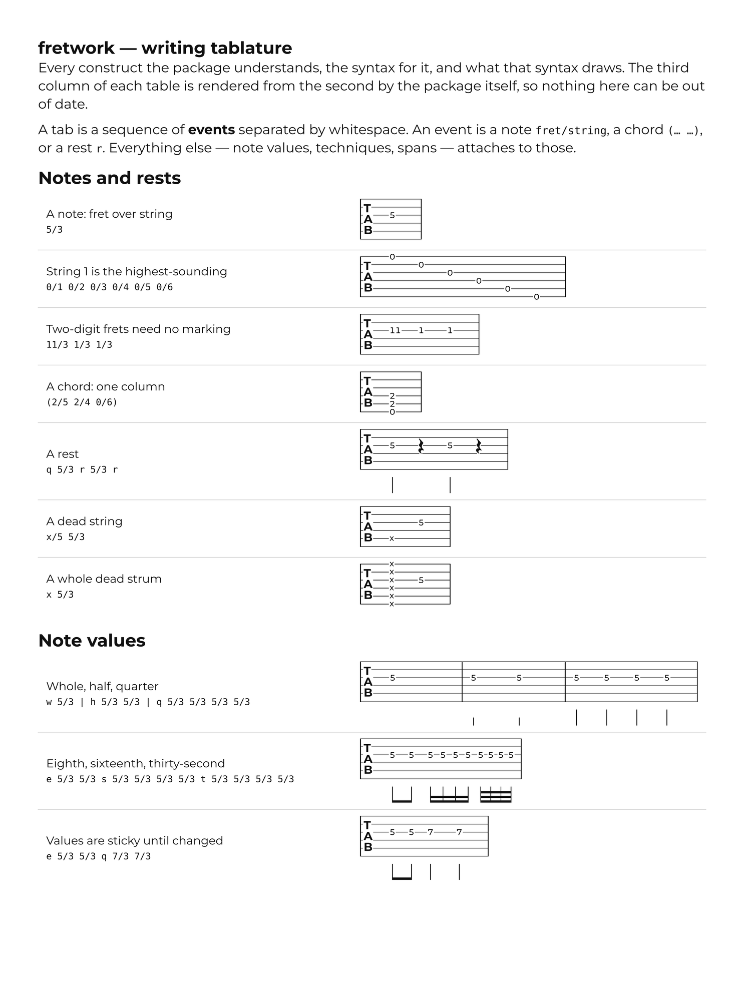
</picture>

<picture>
  <source media="(prefers-color-scheme: dark)" srcset="docs/guide-dark-02.png">
  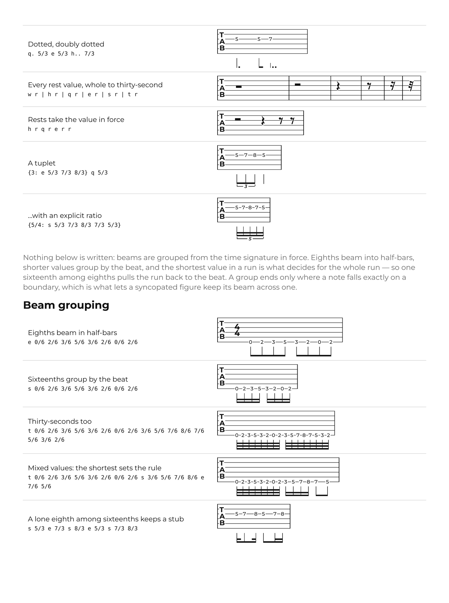
</picture>

<picture>
  <source media="(prefers-color-scheme: dark)" srcset="docs/guide-dark-03.png">
  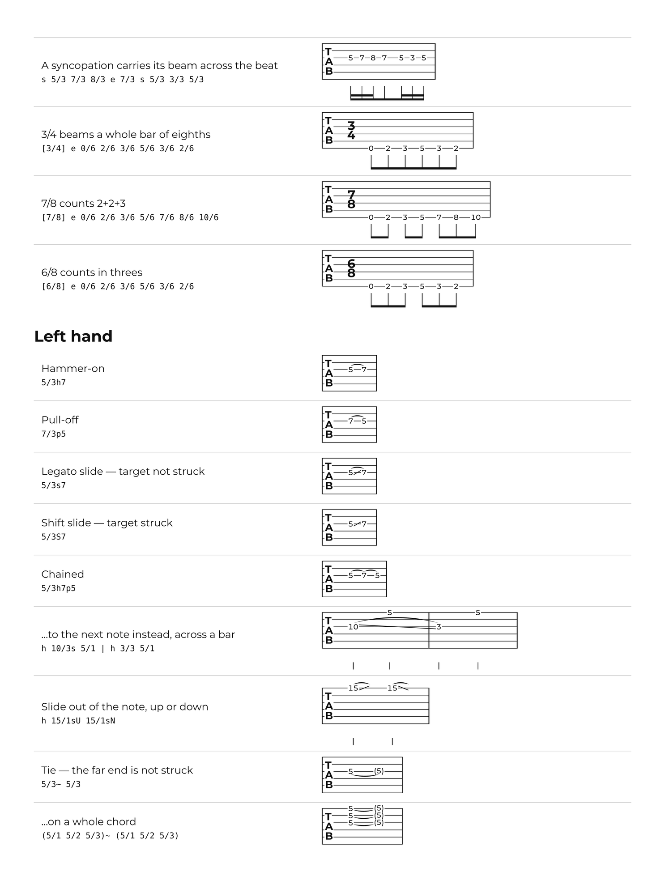
</picture>

<picture>
  <source media="(prefers-color-scheme: dark)" srcset="docs/guide-dark-04.png">
  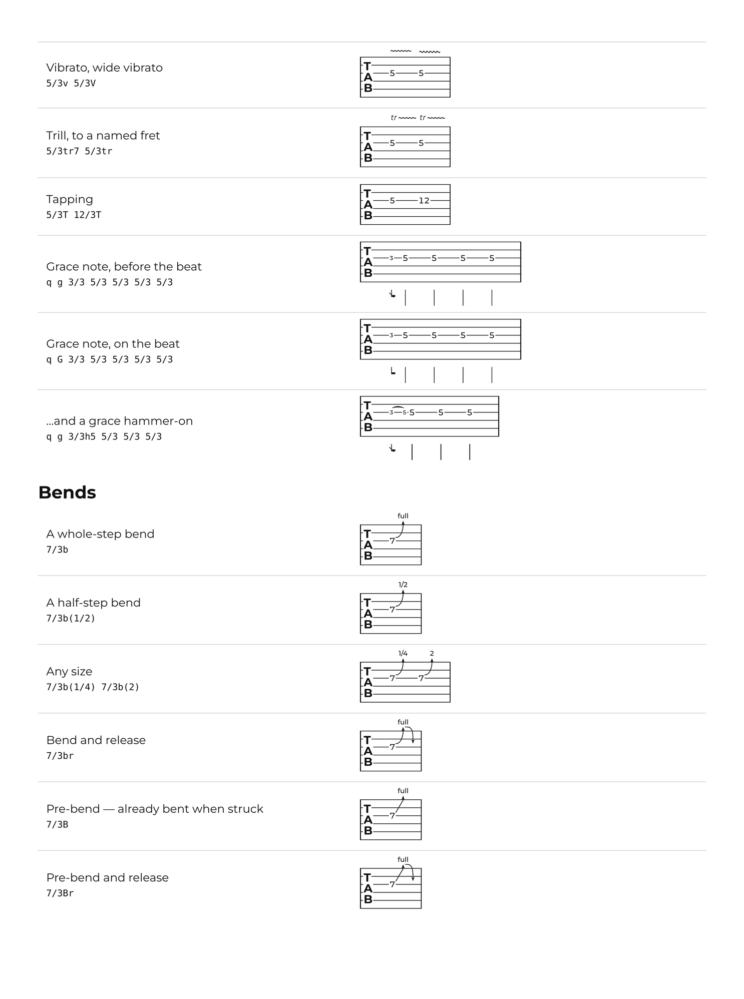
</picture>

<picture>
  <source media="(prefers-color-scheme: dark)" srcset="docs/guide-dark-05.png">
  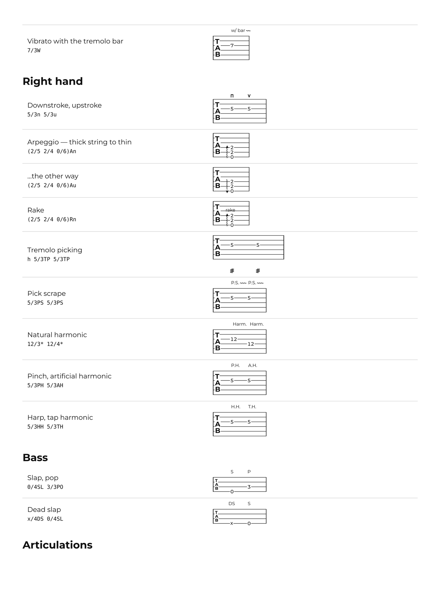
</picture>

<picture>
  <source media="(prefers-color-scheme: dark)" srcset="docs/guide-dark-06.png">
  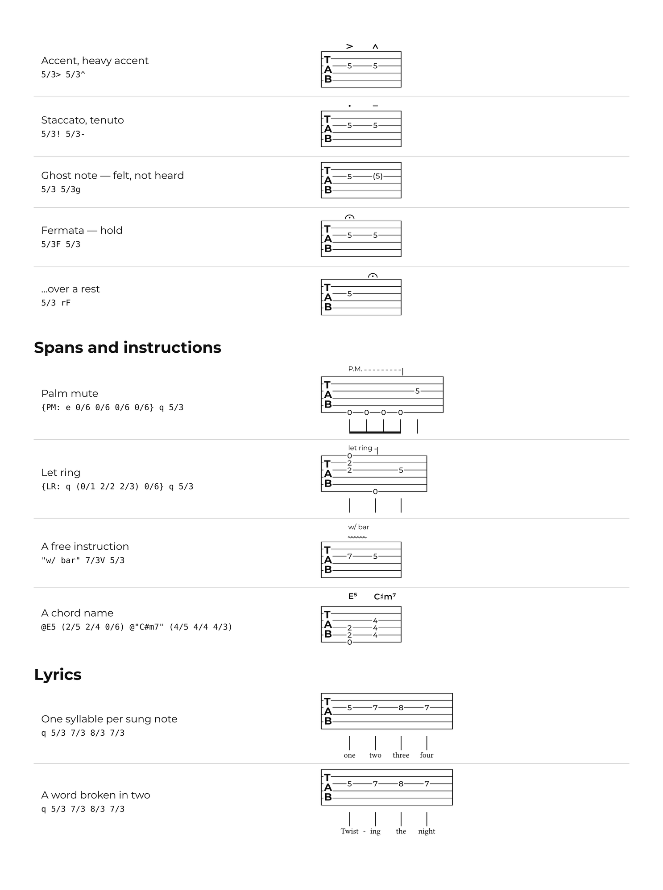
</picture>

<picture>
  <source media="(prefers-color-scheme: dark)" srcset="docs/guide-dark-07.png">
  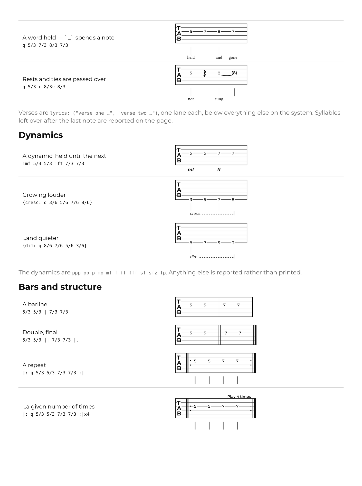
</picture>

<picture>
  <source media="(prefers-color-scheme: dark)" srcset="docs/guide-dark-08.png">
  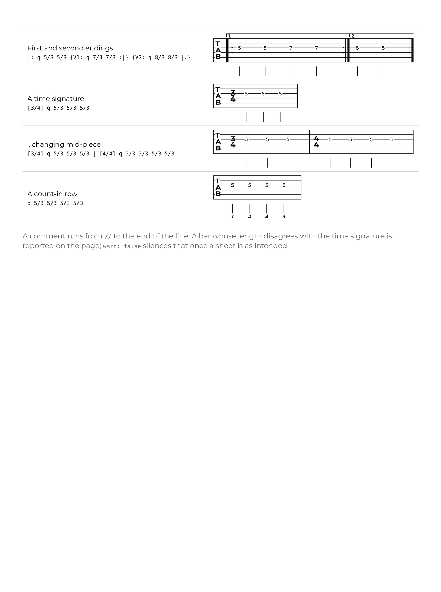
</picture>

<picture>
  <source media="(prefers-color-scheme: dark)" srcset="docs/guide-dark-09.png">
  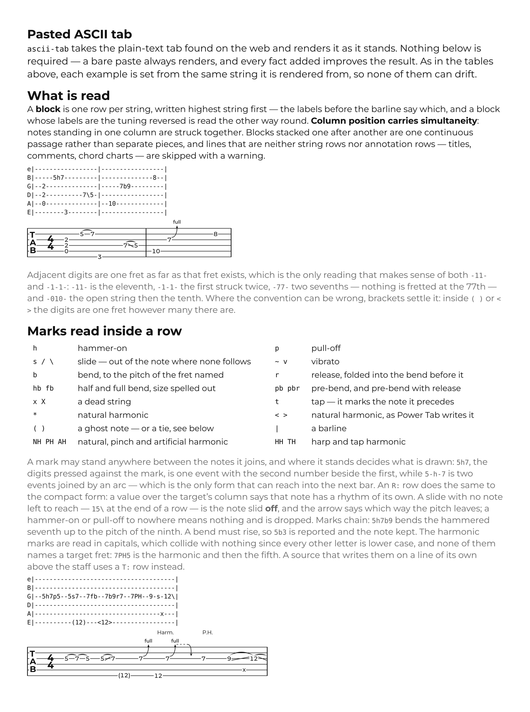
</picture>

<picture>
  <source media="(prefers-color-scheme: dark)" srcset="docs/guide-dark-10.png">
  
</picture>

<picture>
  <source media="(prefers-color-scheme: dark)" srcset="docs/guide-dark-11.png">
  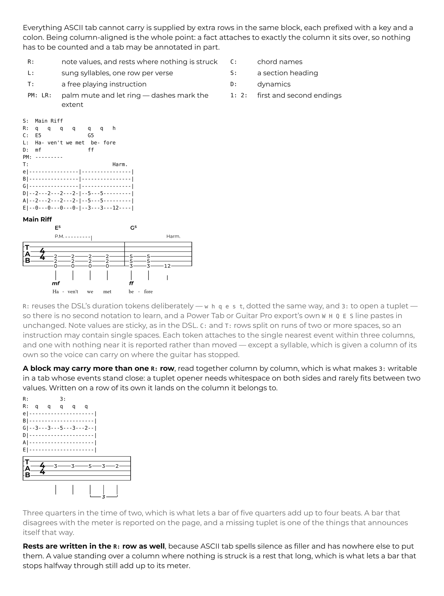
</picture>

<picture>
  <source media="(prefers-color-scheme: dark)" srcset="docs/guide-dark-12.png">
  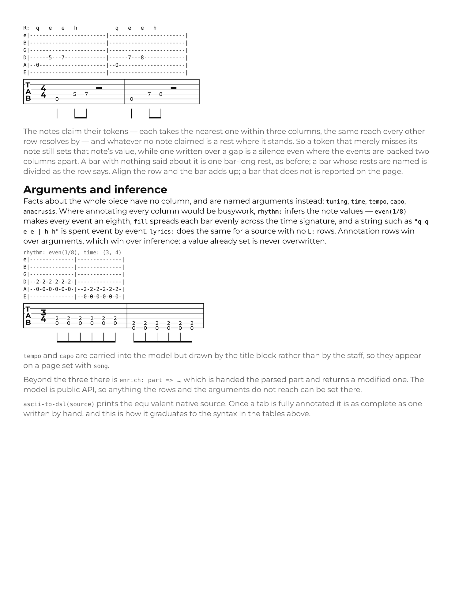
</picture>
