# The fretwork guide

How to use the package, and every construct it understands with what that
construct draws set beside it.

The rendering beside each row is produced by the package from the syntax beside
it. The chapters in [`docs/guide/`](docs/guide/) are the source of both: an
example is written once, and `docs/build-guide.py` renders that same string, so
a row cannot drift from what it documents.

Regenerate with `docs/build.sh`. `GUIDE.md` is written by it — edit the
chapters, not this file.

For the reasoning behind the design, see [SPEC.md](SPEC.md). For a working
sheet, see [`examples/songsheet.typ`](examples/songsheet.typ).

## Getting started

```typst
#import "@preview/fretwork:0.4.0": *

#show: song.with(title: "Twelve Past Nine", music: "A. Guitarist", tempo: 132)

#section("Main Riff")

#tab(```
|: @E5 e 0/6 0/6 {PM: 0/6 0/6 0/6 0/6 0/6 0/6}
 |  @G5 q 3/6 3/6 @A5 5/6 5/6 :|
```)
```

That is the whole shape of it. There are **two layers**, and the split is
deliberate:

- **Document structure is ordinary Typst.** `song`, `section`, `tab` and the
  rest are functions with named arguments, so they autocomplete, type-check and
  take a `theme`.
- **The music is a string.** A riff written as nested function calls is
  unbearable to write and impossible to read, so note-level content is a compact
  syntax of its own — the one the [tablature chapter](#writing-tablature) is
  about.

Nothing but `tab` is required. A bare call renders a staff on its own, wherever
you put it, and everything else on this page is optional:

```
q 5/3 5/3 7/3 7/3
```

<picture><source media="(prefers-color-scheme: dark)" srcset="docs/guide/img/01-000-dark.svg"></picture>


### The music argument

`tab` takes its music as a string or as a raw block. A raw block is usually
easier — it keeps line breaks, needs no escaping, and lets an editor leave the
contents alone:

```typst
#tab(```
q 5/3 5/3 7/3 7/3
```)
```

Both forms reach the same parser, so a string works where a raw block would be
awkward — building the source in code, for instance.

### Which chapter you want

| If you want to | Read |
|---|---|
| write a riff | [Writing tablature](#writing-tablature) |
| set a whole song sheet | [The song sheet](#the-song-sheet) |
| play in something other than standard tuning | [Tunings and capo](#tunings-and-capo) |
| change how it looks | [Appearance](#appearance) |
| set words under the notes | [Lyrics](#lyrics) |
| render tab pasted from the web | [Pasted ASCII tab](#pasted-ascii-tab) |
| look an argument up | [Reference](#reference) |

## The song sheet

`song` is a show rule that sets the page: paper, margins, the title block, the
running head on continuation pages and the copyright line at the foot. Applied
once at the top of a document, everything after it is the music.

````
#show: song.with(
  title: "Twelve Past Nine",
  subtitle: "from the first record",
  words: "A. Guitarist",
  music: "A. Guitarist",
  tempo: 132,
  tempo-words: "Driving Rock",
)

#section("Main Riff")

#tab(```
|: @E5 q 0/6 0/6 @G5 3/6 3/6 | @A5 q 5/6 5/6 @G5 3/6 3/6 :|
```)
````

<picture><source media="(prefers-color-scheme: dark)" srcset="docs/guide/img/02-000-page.svg">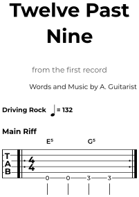</picture>


### Arguments

| Argument | What it does |
|---|---|
| `title` | the sheet's title, centred and largest; also the PDF's document title |
| `subtitle` | a faint line under it |
| `artist` | a faint line under that — who plays it, where `words` and `music` say who wrote it |
| `words`, `music` | the writing credits, right-aligned. Passing the same value to both prints the single "Words and Music by" line the published sheets use |
| `arranged` | a third credit line under those |
| `source` | a small faint line above the title, and the left half of the running head — where the transcription came from |
| `copyright` | centred at the foot of every page. Omitted, there is no footer at all |
| `tempo` | a number: prints as a note and an equals sign, drawn rather than set from a font |
| `tempo-words` | a word before it, such as "Moderately" or "Driving Rock" |
| `tempo-note-flags` | which note the tempo is counted in — `0` a quarter, `1` an eighth |
| `tuning`, `capo` | printed as performance notes under the credits, and used for the string count. See [Tunings and capo](#tunings-and-capo) |
| `theme` | see [Appearance](#appearance) |
| `paper`, `margin` | passed to Typst's own `page`, so any paper name or margin dictionary works |

A sheet that runs past one page repeats its identification in a running head —
the source and the title, then the page number — which is what multi-page
published sheets do. The first page never carries it.

### Section headings

`section` is a heading in the sheet's own type, spaced as the published sheets
space theirs. It is a plain function rather than a `heading` show rule, so it
does not disturb whatever the surrounding document does with headings.

```typst
#section("Main Riff")
#section("Solo")
```

### The tempo mark on its own

`tempo-mark` draws what `song` puts under the title, for a document that wants
it somewhere else — a tempo change halfway down a page, say.

```typst
#tempo-mark(132, words: "Driving Rock")
#tempo-mark(96, note-flags: 1)
```

The note is a drawn glyph rather than U+2669, which most sans faces do not cover
and the rest draw at an unrelated weight.

### Credits on their own

`credits` prints the block of writing credits by itself, taking the same
`words`, `music` and `arranged` that `song` does.

```typst
#credits(words: "A. Guitarist", music: "A. Guitarist", arranged: "You")
```

## Writing tablature

A tab is a sequence of *events* separated by whitespace. An event is a note
`fret/string`, a chord `(… …)`, or a rest `r`. Everything else — note values,
techniques, spans — attaches to those.

### Notes and rests

| What it is | Syntax | |
|---|---|---|
| A note: fret over string | `5/3` | <picture><source media="(prefers-color-scheme: dark)" srcset="docs/guide/img/03-000-dark.svg"></picture> |
| String 1 is the highest-sounding | `0/1 0/2 0/3 0/4 0/5 0/6` | <picture><source media="(prefers-color-scheme: dark)" srcset="docs/guide/img/03-001-dark.svg"></picture> |
| Two-digit frets need no marking | `11/3 1/3 1/3` | <picture><source media="(prefers-color-scheme: dark)" srcset="docs/guide/img/03-002-dark.svg"></picture> |
| A chord: one column | `(2/5 2/4 0/6)` | <picture><source media="(prefers-color-scheme: dark)" srcset="docs/guide/img/03-003-dark.svg">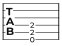</picture> |
| A rest | `q 5/3 r 5/3 r` | <picture><source media="(prefers-color-scheme: dark)" srcset="docs/guide/img/03-004-dark.svg"></picture> |
| A dead string | `x/5 5/3` | <picture><source media="(prefers-color-scheme: dark)" srcset="docs/guide/img/03-005-dark.svg"></picture> |
| A whole dead strum | `x 5/3` | <picture><source media="(prefers-color-scheme: dark)" srcset="docs/guide/img/03-006-dark.svg">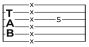</picture> |
| A comment, to end of line | `5/3 // the rest of this line is ignored` | <picture><source media="(prefers-color-scheme: dark)" srcset="docs/guide/img/03-007-dark.svg"></picture> |

### Note values

Note values are sticky: one holds until another is written.

| What it is | Syntax | |
|---|---|---|
| Whole, half, quarter | `w 5/3 \| h 5/3 5/3 \| q 5/3 5/3 5/3 5/3` | <picture><source media="(prefers-color-scheme: dark)" srcset="docs/guide/img/03-008-dark.svg">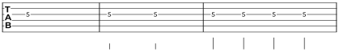</picture> |
| Eighth, sixteenth, thirty-second | `e 5/3 5/3 s 5/3 5/3 5/3 5/3 t 5/3 5/3 5/3 5/3` | <picture><source media="(prefers-color-scheme: dark)" srcset="docs/guide/img/03-009-dark.svg">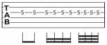</picture> |
| Values are sticky until changed | `e 5/3 5/3 q 7/3 7/3` | <picture><source media="(prefers-color-scheme: dark)" srcset="docs/guide/img/03-010-dark.svg"></picture> |
| Dotted, doubly dotted | `q. 5/3 e 5/3 h.. 7/3` | <picture><source media="(prefers-color-scheme: dark)" srcset="docs/guide/img/03-011-dark.svg"></picture> |
| Every rest value, whole to thirty-second | `w r \| h r \| q r \| e r \| s r \| t r` | <picture><source media="(prefers-color-scheme: dark)" srcset="docs/guide/img/03-012-dark.svg">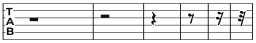</picture> |
| Rests take the value in force | `h r q r e r r` | <picture><source media="(prefers-color-scheme: dark)" srcset="docs/guide/img/03-013-dark.svg">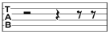</picture> |
| A tuplet | `{3: e 5/3 7/3 8/3} q 5/3` | <picture><source media="(prefers-color-scheme: dark)" srcset="docs/guide/img/03-014-dark.svg"></picture> |
| …with an explicit ratio | `{5/4: s 5/3 7/3 8/3 7/3 5/3}` | <picture><source media="(prefers-color-scheme: dark)" srcset="docs/guide/img/03-015-dark.svg">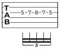</picture> |
| Groups nest | `{3: {PM: e 5/3 7/3} 8/3} q 5/3` | <picture><source media="(prefers-color-scheme: dark)" srcset="docs/guide/img/03-016-dark.svg">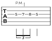</picture> |

### Beam grouping

| What it is | Syntax | |
|---|---|---|
| Eighths beam in half-bars | `e 0/6 2/6 3/6 5/6 3/6 2/6 0/6 2/6` `show-time: true` | <picture><source media="(prefers-color-scheme: dark)" srcset="docs/guide/img/03-017-dark.svg"></picture> |
| Sixteenths group by the beat | `s 0/6 2/6 3/6 5/6 3/6 2/6 0/6 2/6` | <picture><source media="(prefers-color-scheme: dark)" srcset="docs/guide/img/03-018-dark.svg"></picture> |
| A lone eighth among sixteenths keeps a stub | `s 5/3 e 7/3 s 8/3 e 5/3 s 7/3 8/3` | <picture><source media="(prefers-color-scheme: dark)" srcset="docs/guide/img/03-019-dark.svg">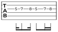</picture> |
| A syncopation carries its beam across the beat | `s 5/3 7/3 8/3 e 7/3 s 5/3 3/3 5/3` | <picture><source media="(prefers-color-scheme: dark)" srcset="docs/guide/img/03-020-dark.svg">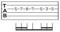</picture> |
| 3/4 beams a whole bar of eighths | `[3/4] e 0/6 2/6 3/6 5/6 3/6 2/6` `show-time: true` | <picture><source media="(prefers-color-scheme: dark)" srcset="docs/guide/img/03-021-dark.svg"></picture> |
| 7/8 counts 2+2+3 | `[7/8] e 0/6 2/6 3/6 5/6 7/6 8/6 10/6` `show-time: true` | <picture><source media="(prefers-color-scheme: dark)" srcset="docs/guide/img/03-022-dark.svg"></picture> |
| 6/8 counts in threes | `[6/8] e 0/6 2/6 3/6 5/6 3/6 2/6` `show-time: true` | <picture><source media="(prefers-color-scheme: dark)" srcset="docs/guide/img/03-023-dark.svg">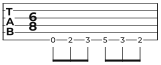</picture> |

### Left hand

| What it is | Syntax | |
|---|---|---|
| Hammer-on | `5/3h7` | <picture><source media="(prefers-color-scheme: dark)" srcset="docs/guide/img/03-024-dark.svg"></picture> |
| Pull-off | `7/3p5` | <picture><source media="(prefers-color-scheme: dark)" srcset="docs/guide/img/03-025-dark.svg">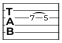</picture> |
| Legato slide — target not struck | `5/3s7` | <picture><source media="(prefers-color-scheme: dark)" srcset="docs/guide/img/03-026-dark.svg">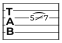</picture> |
| Shift slide — target struck | `5/3S7` | <picture><source media="(prefers-color-scheme: dark)" srcset="docs/guide/img/03-027-dark.svg">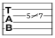</picture> |
| Chained | `5/3h7p5` | <picture><source media="(prefers-color-scheme: dark)" srcset="docs/guide/img/03-028-dark.svg"></picture> |
| …to the next note instead, across a bar | `h 10/3s 5/1 \| h 3/3 5/1` | <picture><source media="(prefers-color-scheme: dark)" srcset="docs/guide/img/03-029-dark.svg">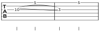</picture> |
| Slide out of the note, up or down | `h 15/1sU 15/1sN` | <picture><source media="(prefers-color-scheme: dark)" srcset="docs/guide/img/03-030-dark.svg"></picture> |
| Tie — the far end is not struck | `5/3~ 5/3` | <picture><source media="(prefers-color-scheme: dark)" srcset="docs/guide/img/03-031-dark.svg">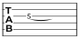</picture> |
| …on a whole chord | `(5/1 5/2 5/3)~ (5/1 5/2 5/3)` | <picture><source media="(prefers-color-scheme: dark)" srcset="docs/guide/img/03-032-dark.svg">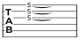</picture> |
| Vibrato, wide vibrato | `5/3v 5/3V` | <picture><source media="(prefers-color-scheme: dark)" srcset="docs/guide/img/03-033-dark.svg">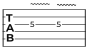</picture> |
| Trill, to a named fret | `5/3tr7 5/3tr` | <picture><source media="(prefers-color-scheme: dark)" srcset="docs/guide/img/03-034-dark.svg"></picture> |
| Tapping | `5/3T 12/3T` | <picture><source media="(prefers-color-scheme: dark)" srcset="docs/guide/img/03-035-dark.svg">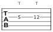</picture> |
| Grace note, before the beat | `q g 3/3 5/3 5/3 5/3 5/3` | <picture><source media="(prefers-color-scheme: dark)" srcset="docs/guide/img/03-036-dark.svg">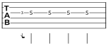</picture> |
| Grace note, on the beat | `q G 3/3 5/3 5/3 5/3 5/3` | <picture><source media="(prefers-color-scheme: dark)" srcset="docs/guide/img/03-037-dark.svg">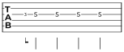</picture> |
| …and a grace hammer-on | `q g 3/3h5 5/3 5/3 5/3` | <picture><source media="(prefers-color-scheme: dark)" srcset="docs/guide/img/03-038-dark.svg"></picture> |

### Bends

| What it is | Syntax | |
|---|---|---|
| A whole-step bend | `7/3b` | <picture><source media="(prefers-color-scheme: dark)" srcset="docs/guide/img/03-039-dark.svg">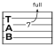</picture> |
| A half-step bend | `7/3b(1/2)` | <picture><source media="(prefers-color-scheme: dark)" srcset="docs/guide/img/03-040-dark.svg"></picture> |
| Any size | `7/3b(1/4) 7/3b(2)` | <picture><source media="(prefers-color-scheme: dark)" srcset="docs/guide/img/03-041-dark.svg"></picture> |
| Bend and release | `7/3br` | <picture><source media="(prefers-color-scheme: dark)" srcset="docs/guide/img/03-042-dark.svg">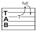</picture> |
| Pre-bend — already bent when struck | `7/3B` | <picture><source media="(prefers-color-scheme: dark)" srcset="docs/guide/img/03-043-dark.svg"></picture> |
| Pre-bend and release | `7/3Br` | <picture><source media="(prefers-color-scheme: dark)" srcset="docs/guide/img/03-044-dark.svg"></picture> |
| Vibrato with the tremolo bar | `7/3W` | <picture><source media="(prefers-color-scheme: dark)" srcset="docs/guide/img/03-045-dark.svg"></picture> |

### Right hand

| What it is | Syntax | |
|---|---|---|
| Downstroke, upstroke | `5/3n 5/3u` | <picture><source media="(prefers-color-scheme: dark)" srcset="docs/guide/img/03-046-dark.svg">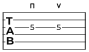</picture> |
| Arpeggio — thick string to thin | `(2/5 2/4 0/6)A` | <picture><source media="(prefers-color-scheme: dark)" srcset="docs/guide/img/03-047-dark.svg"></picture> |
| …written out, and the other way | `(2/5 2/4 0/6)An (2/5 2/4 0/6)Au` | <picture><source media="(prefers-color-scheme: dark)" srcset="docs/guide/img/03-048-dark.svg"></picture> |
| Rake | `(2/5 2/4 0/6)R` | <picture><source media="(prefers-color-scheme: dark)" srcset="docs/guide/img/03-049-dark.svg">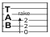</picture> |
| …and the other way | `(2/5 2/4 0/6)Ru` | <picture><source media="(prefers-color-scheme: dark)" srcset="docs/guide/img/03-050-dark.svg"></picture> |
| Tremolo picking | `h 5/3TP 5/3TP` | <picture><source media="(prefers-color-scheme: dark)" srcset="docs/guide/img/03-051-dark.svg">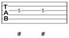</picture> |
| Pick scrape, to the fret it stops at | `q x/3PS1 5/3 5/3 5/3` | <picture><source media="(prefers-color-scheme: dark)" srcset="docs/guide/img/03-052-dark.svg"></picture> |
| …the same over a longer note | `h. x/3PS12 q 5/3` | <picture><source media="(prefers-color-scheme: dark)" srcset="docs/guide/img/03-053-dark.svg">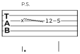</picture> |
| …or to the next note on the string | `q x/3PS 5/3 5/3 5/3` | <picture><source media="(prefers-color-scheme: dark)" srcset="docs/guide/img/03-054-dark.svg">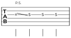</picture> |
| Natural harmonic | `12/3* 12/4*` | <picture><source media="(prefers-color-scheme: dark)" srcset="docs/guide/img/03-055-dark.svg"></picture> |
| Pinch, artificial harmonic | `5/3PH 5/3AH` | <picture><source media="(prefers-color-scheme: dark)" srcset="docs/guide/img/03-056-dark.svg">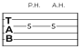</picture> |
| Harp, tap harmonic | `5/3HH 5/3TH` | <picture><source media="(prefers-color-scheme: dark)" srcset="docs/guide/img/03-057-dark.svg"></picture> |

### Bass

| What it is | Syntax | |
|---|---|---|
| Slap, pop | `0/4SL 3/3PO` `tuning: tunings.bass` | <picture><source media="(prefers-color-scheme: dark)" srcset="docs/guide/img/03-058-dark.svg"></picture> |
| Dead slap | `x/4DS 0/4SL` `tuning: tunings.bass` | <picture><source media="(prefers-color-scheme: dark)" srcset="docs/guide/img/03-059-dark.svg">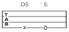</picture> |

### Articulations

A note may carry a length mark, an attack mark and a stroke direction at once;
all three are drawn, stacked outward from the staff.

| What it is | Syntax | |
|---|---|---|
| Accent, heavy accent | `5/3> 5/3^` | <picture><source media="(prefers-color-scheme: dark)" srcset="docs/guide/img/03-060-dark.svg"></picture> |
| Staccato, tenuto | `5/3! 5/3-` | <picture><source media="(prefers-color-scheme: dark)" srcset="docs/guide/img/03-061-dark.svg">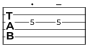</picture> |
| All three at once | `5/3!>n 5/3-^u` | <picture><source media="(prefers-color-scheme: dark)" srcset="docs/guide/img/03-062-dark.svg">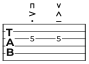</picture> |
| Ghost note — felt, not heard | `5/3 5/3g` | <picture><source media="(prefers-color-scheme: dark)" srcset="docs/guide/img/03-063-dark.svg"></picture> |
| Fermata — hold | `5/3F 5/3` | <picture><source media="(prefers-color-scheme: dark)" srcset="docs/guide/img/03-064-dark.svg">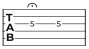</picture> |
| …over a rest | `5/3 rF` | <picture><source media="(prefers-color-scheme: dark)" srcset="docs/guide/img/03-065-dark.svg">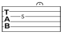</picture> |

### Spans and instructions

| What it is | Syntax | |
|---|---|---|
| Palm mute | `{PM: e 0/6 0/6 0/6 0/6} q 5/3` | <picture><source media="(prefers-color-scheme: dark)" srcset="docs/guide/img/03-066-dark.svg"></picture> |
| Let ring | `{LR: q (0/1 2/2 2/3) 0/6} q 5/3` | <picture><source media="(prefers-color-scheme: dark)" srcset="docs/guide/img/03-067-dark.svg"></picture> |
| A free instruction | `"w/ bar" 7/3V 5/3` | <picture><source media="(prefers-color-scheme: dark)" srcset="docs/guide/img/03-068-dark.svg">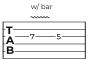</picture> |
| A chord name | `@E5 (2/5 2/4 0/6) @"C#m7" (4/5 4/4 4/3)` | <picture><source media="(prefers-color-scheme: dark)" srcset="docs/guide/img/03-069-dark.svg">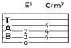</picture> |

### Dynamics

A dynamic holds until the next one. The set is closed: `ppp pp p mp mf f ff fff
sf sfz fp`.

| What it is | Syntax | |
|---|---|---|
| A dynamic, held until the next | `!mf 5/3 5/3 !ff 7/3 7/3` | <picture><source media="(prefers-color-scheme: dark)" srcset="docs/guide/img/03-070-dark.svg"></picture> |
| Growing louder | `{cresc: q 3/6 5/6 7/6 8/6}` | <picture><source media="(prefers-color-scheme: dark)" srcset="docs/guide/img/03-071-dark.svg"></picture> |
| …and quieter | `{dim: q 8/6 7/6 5/6 3/6}` | <picture><source media="(prefers-color-scheme: dark)" srcset="docs/guide/img/03-072-dark.svg">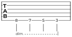</picture> |

### Bars and structure

| What it is | Syntax | |
|---|---|---|
| A barline | `5/3 5/3 \| 7/3 7/3` | <picture><source media="(prefers-color-scheme: dark)" srcset="docs/guide/img/03-073-dark.svg">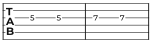</picture> |
| Double, final | `5/3 5/3 \|\| 7/3 7/3 \|.` | <picture><source media="(prefers-color-scheme: dark)" srcset="docs/guide/img/03-074-dark.svg"></picture> |
| A repeat | `\|: q 5/3 5/3 7/3 7/3 :\|` | <picture><source media="(prefers-color-scheme: dark)" srcset="docs/guide/img/03-075-dark.svg"></picture> |
| …a given number of times | `\|: q 5/3 5/3 7/3 7/3 :\|x4` | <picture><source media="(prefers-color-scheme: dark)" srcset="docs/guide/img/03-076-dark.svg"></picture> |
| First and second endings | `\|: q 5/3 5/3 \| {V1: q 7/3 7/3 :\|} {V2: q 8/3 8/3 \|.}` | <picture><source media="(prefers-color-scheme: dark)" srcset="docs/guide/img/03-077-dark.svg"></picture> |
| A time signature | `[3/4] q 5/3 5/3 5/3` | <picture><source media="(prefers-color-scheme: dark)" srcset="docs/guide/img/03-078-dark.svg">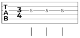</picture> |
| …changing mid-piece | `[3/4] q 5/3 5/3 5/3 \| [4/4] q 5/3 5/3 5/3 5/3` | <picture><source media="(prefers-color-scheme: dark)" srcset="docs/guide/img/03-079-dark.svg">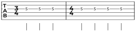</picture> |
| A count-in row | `q 5/3 5/3 5/3 5/3` `count-in: true` | <picture><source media="(prefers-color-scheme: dark)" srcset="docs/guide/img/03-080-dark.svg"></picture> |
| A pick-up bar before the first full one | `q 5/3 \| q 7/3 7/3 7/3 7/3` `anacrusis: true` | <picture><source media="(prefers-color-scheme: dark)" srcset="docs/guide/img/03-081-dark.svg"></picture> |

## Tunings and capo

A tuning does three things: it says how many strings the staff has, it labels
them, and it gives each one a pitch so that a bend knows how far it is bending.
Pass it to `tab`, or to `song` to set it for a whole sheet.

What a tuning changes on the page is the **number of string lines**. It does not
change the numbers: a fret is a fret, and `0/6` is the open sixth string in Drop
D exactly as in standard. What changes is what that string sounds — which is
what the bends measure against, and what `song` prints under the credits.

| What it is | Syntax | |
|---|---|---|
| Six strings, the default | `q 0/6 0/5 0/4 0/3 0/2 0/1` | <picture><source media="(prefers-color-scheme: dark)" srcset="docs/guide/img/04-000-dark.svg">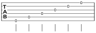</picture> |
| Seven | `q 0/7 0/6 0/5 0/4 0/3 0/2 0/1` `tuning: tunings.seven-string` | <picture><source media="(prefers-color-scheme: dark)" srcset="docs/guide/img/04-001-dark.svg">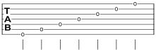</picture> |
| Bass — four | `q 0/4 0/3 0/2 0/1` `tuning: tunings.bass` | <picture><source media="(prefers-color-scheme: dark)" srcset="docs/guide/img/04-002-dark.svg">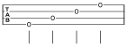</picture> |
| Five-string bass | `q 0/5 0/4 0/3 0/2 0/1` `tuning: tunings.bass-5` | <picture><source media="(prefers-color-scheme: dark)" srcset="docs/guide/img/04-003-dark.svg">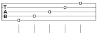</picture> |
| Ukulele — four, and much higher | `q 0/4 0/3 0/2 0/1` `tuning: tunings.ukulele` | <picture><source media="(prefers-color-scheme: dark)" srcset="docs/guide/img/04-004-dark.svg"></picture> |

### The built-in tunings

| Name | Strings | Name | Strings |
|---|---|---|---|
| `tunings.standard` | E4 B3 G3 D3 A2 E2 | `tunings.drop-d` | E4 B3 G3 D3 A2 D2 |
| `tunings.drop-c` | D4 A3 F3 C3 G2 C2 | `tunings.half-step-down` | E♭4 B♭3 G♭3 D♭3 A♭2 E♭2 |
| `tunings.full-step-down` | D4 A3 F3 C3 G2 D2 | `tunings.open-g` | D4 B3 G3 D3 G2 D2 |
| `tunings.open-d` | D4 A3 F♯3 D3 A2 D2 | `tunings.dadgad` | D4 A3 G3 D3 A2 D2 |
| `tunings.seven-string` | E4 B3 G3 D3 A2 E2 B1 | `tunings.bass` | G2 D2 A1 E1 |
| `tunings.bass-5` | G2 D2 A1 E1 B0 | `tunings.ukulele` | A4 E4 C4 G4 |

Drop D and Drop C keep the sixth string tuned below the fifth, which is what
lets a power chord be one finger across three strings — and what makes a `0/6`
in them sound a tone or a fourth below the same `0/6` in standard.

`song` prints the tuning's name as a performance note under the credits, unless
it is standard — which is what a published sheet does, and why the standard
tuning is the one that says nothing.

### Writing your own

`tuning` takes the pitches highest string first, as scientific pitch names.
A name and string labels are optional; without labels the staff is unlabelled,
which is what the built-in tunings other than standard and Drop D do.

```typst
#let open-c = tuning("E4 C4 G3 C3 G2 C2", name: "Open C")
#tab(tuning: open-c, ```q 0/6 0/5 0/4 0/3 0/2 0/1```)
```

Any number of strings works, so a lute, a bass VI or a stick are a `tuning` call
away. The pitches are what the bend arrows read: a bend is drawn in steps, and a
step is a step of the string it is on.

### Capo

`capo` is a whole-sheet fact rather than a per-note one: the fret numbers are
written relative to the capo, as every published sheet writes them, and the capo
says where that zero really is. It shifts the pitches used for bends and is
printed as a performance note under the credits.

```typst
#tab(capo: 3, ```q 0/6 2/6 3/6 2/6```)
```

Nothing on the staff changes — `0/6` is still the open sixth string. What
changes is what that string sounds, which is what the bends and the printed note
are about.

## Appearance

Every measurement on the page derives from one unit, `staff-space` — the
distance between two string lines. Line weights, stem lengths, beam thickness
and type sizes are all fractions of it, so changing that one value rescales a
whole sheet without the proportions drifting.

`theme()` builds a theme; pass it to `tab`, or to `song` for a whole sheet.

```typst
#tab(theme: theme(staff-space: 3.2mm), ```q 5/3 5/3 7/3 7/3```)
```

### Size

| What it is | Syntax | |
|---|---|---|
| The default, 2.9 mm | `\|: q 5/3 5/3 7/3 7/3 :\|` `theme: theme()` | <picture><source media="(prefers-color-scheme: dark)" srcset="docs/guide/img/05-000-dark.svg">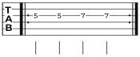</picture> |
| Smaller | `\|: q 5/3 5/3 7/3 7/3 :\|` `theme: theme(staff-space: 2.2mm)` | <picture><source media="(prefers-color-scheme: dark)" srcset="docs/guide/img/05-001-dark.svg">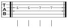</picture> |
| Larger | `\|: q 5/3 5/3 7/3 7/3 :\|` `theme: theme(staff-space: 4mm)` | <picture><source media="(prefers-color-scheme: dark)" srcset="docs/guide/img/05-002-dark.svg"></picture> |

### Repeat signs

`repeat-style` is `"plain"` by default — the bare thick-thin-and-dots sign.
`"ornate"` adds the flared serifs of an engraved one, as published rock tab uses.

| What it is | Syntax | |
|---|---|---|
| Plain, the default | `\|: q 5/3 5/3 7/3 7/3 :\|` `theme: theme()` | <picture><source media="(prefers-color-scheme: dark)" srcset="docs/guide/img/05-003-dark.svg"></picture> |
| Ornate | `\|: q 5/3 5/3 7/3 7/3 :\|` `theme: theme(repeat-style: "ornate")` | <picture><source media="(prefers-color-scheme: dark)" srcset="docs/guide/img/05-004-dark.svg">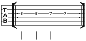</picture> |

### Fret numbers on the lines

A fret number sits on its string's line, so something has to give way. `mask` is
`"gap"` by default, which breaks the line around the digits the way the
published sheets do. `"box"` draws them on an opaque patch instead, which is
what works on a tinted page.

| What it is | Syntax | |
|---|---|---|
| A gap in the line, the default | `q 12/3 5/3 11/3 7/3` `theme: theme()` | <picture><source media="(prefers-color-scheme: dark)" srcset="docs/guide/img/05-005-dark.svg">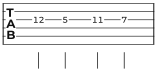</picture> |
| An opaque patch | `q 12/3 5/3 11/3 7/3` `theme: theme(mask: "box")` | <picture><source media="(prefers-color-scheme: dark)" srcset="docs/guide/img/05-006-dark.svg"></picture> |

### Ink

`color` is everything the staff draws — lines, numbers, stems, every mark. Any
Typst colour works.

| What it is | Syntax | |
|---|---|---|
| Ink of your own | `q 5/3 5/3 7/3 7/3` `theme: theme(color: rgb("#2f81f7"))` | <picture><source media="(prefers-color-scheme: dark)" srcset="docs/guide/img/05-007-dark.svg">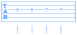</picture> |

`faint` is the second ink, and belongs to the title block rather than the staff:
the subtitle, the artist, the source line, the performance notes under the
credits, the running head and the copyright line. Nothing `tab` draws uses it,
so it only shows on a sheet set with [`song`](#the-song-sheet).

### Type

`font` is the music's type — fret numbers, chord names, instructions — and takes
a family or a list of fallbacks. `lyric-font` is the sung words, set in a serif
so that a syllable is never mistaken for a playing instruction.

The default is `("Montserrat", "Noto Sans", "DejaVu Sans")`, which is the face
the package was designed against and degrades to whatever is installed. No music
font is needed for either: every symbol is a vector curve.

```typst
#tab(theme: theme(font: ("Noto Sans", "DejaVu Sans")), ```q 12/3 5/3 11/3```)
```

### A rule under a held word

A word sung over several notes is written once. `lyric-extender` draws a rule
after it, running to the last note it is held over. Vocal scores use one; the
published *tab* sheets this package is set to look like do not, so it is off.

| What it is | Syntax | |
|---|---|---|
| Off, the default | `q 5/3 7/3 8/3 7/3` `lyrics: "held _ _ gone", theme: theme()` | <picture><source media="(prefers-color-scheme: dark)" srcset="docs/guide/img/05-008-dark.svg"></picture> |
| On | `q 5/3 7/3 8/3 7/3` `lyrics: "held _ _ gone", theme: theme(lyric-extender: true)` | <picture><source media="(prefers-color-scheme: dark)" srcset="docs/guide/img/05-009-dark.svg"></picture> |

### Everything else a theme holds

`theme()` takes the eight arguments above, and returns a **plain dictionary** of
every measurement derived from them — line weights, type sizes, horizontal
spacing, the gaps between lanes. Those are not arguments, because they normally
follow from `staff-space` and setting them by hand is how proportions drift.

Where you do want one, merge it in. A theme is a dictionary, so `+` is all it
takes:

```typst
#tab(
  theme: theme(staff-space: 3.6mm) + (
    min-event-gap: 1.1 * 3.6mm,
    quarter-width: 5.5 * 3.6mm,
  ),
  ```q 5/3 5/3 7/3 7/3```,
)
```

The values in the dictionary are **absolute lengths**, already multiplied out, so
an override has to be multiplied by your own staff space rather than the
default.

| Key | Default | What it governs |
|---|---|---|
| `line`, `barline`, `heavy-barline` | 0.075, 0.12, 0.45 sp | rule weights |
| `gap-padding` | 0.08 sp | air either side of a fret number where the line breaks |
| `stem`, `stem-length` | 0.09, 2.0 sp | the rhythm lane's stems |
| `beam-thickness`, `beam-gap` | 0.286 sp each | beams, and the augmentation dot, which is a beam thick |
| `rhythm-clearance` | 0.15 sp | staff to the top of the stems |
| `fret-size`, `chord-size`, `section-size`, `count-size`, `technique-size`, `lyric-size`, `bend-size`, `tempo-size`, `title-size`, `credit-size`, `copyright-size` | 0.8–3.4 sp | type sizes |
| `spacing-exponent` | 0.6 | how fast width grows with duration |
| `quarter-width` | 3.6 sp | width of a quarter before justification |
| `min-event-gap` | 0.55 sp | least air between two events |
| `lyric-gap` | 0.8 sp | least air between two syllables |
| `measure-padding` | 0.7 sp | air inside the barlines |
| `tab-mark-width` | 2.7 sp | room for the vertical `TAB` mark |
| `system-gap`, `lane-gap` | 4.0, 0.30 sp | vertical space between systems, and between lanes |

Spacing is optical rather than proportional: width grows with duration, but far
more slowly, so a whole note does not eat a whole system. `spacing-exponent` is
that curve.

## Lyrics

Syllables are **not** written inline. They would drown the notes, and there is
already a pattern for data that runs parallel to the music and lines up with it
event by event. Lyrics follow it: a string of space-separated syllables, spent in
order over the events that are actually sung.

| What it is | Syntax | |
|---|---|---|
| One syllable per sung note | `q 5/3 7/3 8/3 7/3` `lyrics: "one two three four"` | <picture><source media="(prefers-color-scheme: dark)" srcset="docs/guide/img/06-000-dark.svg"></picture> |
| A word broken in two | `q 5/3 7/3 8/3 7/3` `lyrics: "Twist- ing the night"` | <picture><source media="(prefers-color-scheme: dark)" srcset="docs/guide/img/06-001-dark.svg"></picture> |
| A word held — `_` spends a note | `q 5/3 7/3 8/3 7/3` `lyrics: "held _ and gone"` | <picture><source media="(prefers-color-scheme: dark)" srcset="docs/guide/img/06-002-dark.svg"></picture> |
| Rests and ties are passed over | `q 5/3 r 8/3~ 8/3` `lyrics: "not sung"` | <picture><source media="(prefers-color-scheme: dark)" srcset="docs/guide/img/06-003-dark.svg"></picture> |

A trailing `-` hyphenates into the next syllable. `_` spends a note without
printing anything, which is how a word held over several notes is written — the
far end of a tie is passed over for the same reason it prints no number: it is
not a new attack, so it keeps the syllable of the note it is held from.

### Several verses

`lyrics` takes a list, one string per verse, and each verse gets a lane of its
own under the staff.

| What it is | Syntax | |
|---|---|---|
| Two verses, two lanes | `q 5/3 7/3 8/3 7/3` `lyrics: ("one two three four", "five six seven eight")` | <picture><source media="(prefers-color-scheme: dark)" srcset="docs/guide/img/06-004-dark.svg"></picture> |

Where more than one verse is sung, each lane carries its number just before its
first syllable, on the system where it begins — which is what tells one stanza's
row from another's under a repeated passage, whose music is written once while
its words are written out a row per time round.

`verse-labels` replaces the numbering with your own, one per verse. An empty
string leaves a lane unlabelled.

| What it is | Syntax | |
|---|---|---|
| Labels of your own | `q 5/3 7/3 8/3 7/3` `lyrics: ("one two three four", "five six seven eight"), verse-labels: ("V.", "Ch.")` | <picture><source media="(prefers-color-scheme: dark)" srcset="docs/guide/img/06-005-dark.svg"></picture> |

### Words written for another part

A verse spent over the notes is one written for *this* music. A singer's line
under a guitar's staff is not: the two share bars but not notes, so counting
through the guitar's notes would start the first word bars before anyone sings.

`lyric-at(measure, position, text)` gives each syllable a moment instead —
the measure it falls in, counted from zero, and where in that measure, as a
fraction of a whole note or as a `(numerator, denominator)` pair.

```typst
#tab(
  lyrics: ((lyric-at(0, (1, 2), "half-"), lyric-at(1, 0, "way")),),
  ```q 5/3 5/3 5/3 5/3 | q 7/3 7/3 7/3 7/3```,
)
```

A bar is settled one way or the other, never both. Where every syllable finds an
event of its own it is hung on that event; where any cannot — a bar the part
rests through is a *single* whole rest, and a phrase sung across it is not — all
of them are placed by their moments instead. Mixing the two put syllables in one
bar on two different timelines, and they collided.

A moment is read against the **notes**, not against the bar's width: events are
spaced optically, so a fraction of the width lands nowhere near the note sounding
then. And a bar is widened for what is sung across it, since otherwise it is
spaced only for what it plays.

Both forms may be mixed, one verse each, and every verse keeps the lane its
position in the argument gives it.

### A syllable with nothing to sit on

A syllable with no note near it gets a column of its own rather than being
dropped: a singer carries on where the guitar stops, and a bar the transcription
leaves empty is exactly where that happens.

See also [`lyric-extender`](#a-rule-under-a-held-word), which draws a rule after
a held word, and `L:` rows in [Pasted ASCII tab](#annotation-rows).

## Pasted ASCII tab

`ascii-tab` takes the plain-text tab found on the web and renders it as it
stands. Nothing below is required — a bare paste always renders, and every fact
added improves the result. As in the tables above, each example is set from the
same string it is rendered from, so none of them can drift.

### What is read

A *block* is one row per string, written highest string first — the labels
before the barline say which, and a block whose labels are the tuning reversed
is read the other way round. *Column position carries simultaneity*: notes
standing in one column are struck together. Blocks stacked one after another
are one continuous passage rather than separate pieces, and lines that are
neither string rows nor annotation rows — titles, comments, chord charts — are
skipped with a warning.

```
e|-----------------|-----------------|
B|-----5h7---------|--------------8--|
G|--2--------------|-----7b9---------|
D|--2----------7\5-|-----------------|
A|--0--------------|--10-------------|
E|--------3--------|-----------------|
```

<picture><source media="(prefers-color-scheme: dark)" srcset="docs/guide/img/07-000-dark.svg"></picture>


Adjacent digits are one fret as far as that fret exists, which is the only
reading that makes sense of both `-11-` and `-1-1-`: `-11-` is the eleventh,
`-1-1-` the first struck twice, `-77-` two sevenths — nothing is fretted at
the 77th — and `-010-` the open string then the tenth. Where the convention
can be wrong, brackets settle it: inside `( )` or `< >` the digits are one
fret however many there are.

### Marks read inside a row

| Mark | Meaning | Mark | Meaning |
|---|---|---|---|
| `h` | hammer-on | `p` | pull-off |
| `s` `\` | slide — out of the note where none follows | `~` `v` | vibrato |
| `b` | bend, to the pitch of the fret named | `r` | release, folded into the bend before it |
| `hb` `fb` | half and full bend, size spelled out | `pb` `pbr` | pre-bend, and pre-bend with release |
| `x` `X` | a dead string | `t` | tap — it marks the note it precedes |
| `*` | natural harmonic | `<` `>` | natural harmonic, as Power Tab writes it |
| `( )` | a ghost note — or a tie, see below | `\|` | a barline |
| `NH` `PH` `AH` | natural, pinch and artificial harmonic | `HH` `TH` | harp and tap harmonic |

A mark may stand anywhere between the notes it joins, and where it stands
decides what is drawn: `5h7`, the digits pressed against the mark, is one
event with the second number beside the first, while `5-h-7` is two events
joined by an arc — which is the only form that can reach into the next bar. An
`R:` row does the same to the compact form: a value over the target's column
says that note has a rhythm of its own. A slide with no note left to reach —
`15\` at the end of a row — is the note slid *off*, and the arrow says which
way the pitch leaves; a hammer-on or pull-off to nowhere means nothing and is
dropped. Marks chain: `5h7b9` bends the hammered seventh up to the pitch of the
ninth. A bend must rise, so `5b3` is reported and the note kept. The harmonic
marks are read in capitals, which collide with nothing since every other letter
is lower case, and none of them names a target fret: `7PH5` is the harmonic and
then the fifth. A source that writes them on a line of its own above the staff
uses a `T:` row instead. A pick scrape is written the same way but against an
`x`, having no pitch of its own — and it *does* read the digits against it,
`xPS1`, since those name the fret the pick stops at rather than a second attack.

```
e|--------------------------------------|
B|--------------------------------------|
G|--5h7p5--5s7--7fb--7b9r7--7PH--9-s-12\|
D|--xPS------5--------------------------|
A|----------------------------------x---|
E|----------(12)---<12>-----------------|
```

<picture><source media="(prefers-color-scheme: dark)" srcset="docs/guide/img/07-001-dark.svg"></picture>


**A fret in parentheses that repeats the note before it on the same string is a
tie** — the string is still sounding and is not struck again. Any other fret in
them is the ghost note the brackets otherwise mean. There is no other way to
write a held note in ASCII tab, where `~` is vibrato whatever the native syntax
uses it for.

`rhythm: even(1/4)`

```
e|--------------------------|--------------------------|
B|--------------------------|--------------------------|
G|--5-----(5)-----7-----(7)-|--------------------------|
D|--------------------------|--------------------------|
A|--------------------------|--0-----3-----(0)-----5---|
E|--------------------------|--------------------------|
```

<picture><source media="(prefers-color-scheme: dark)" srcset="docs/guide/img/07-002-dark.svg"></picture>


Both are written the same, in brackets, so the reading is what separates them —
and it is set back out differently: a ghost note keeps its brackets, a tie's
far end prints no number at all and is carried by the arc alone. A note struck
in between ends what the first was sounding, which is why the `(0)` above is a
ghost note and not a tie. A tie is read across a barline but not across the end
of a block, the reading being made row by row like every other mark that joins
two notes.

### Barlines, repeats and endings

`|` is a barline, and `||` is one barline drawn twice rather than two with a
bar of silence between them. The repeat colons are read as music: `|:` opens a
repeat, `:|` closes one, `:|:` closes one and opens the next where a repeated
section runs straight into another, and `x3` after the closing stroke says how
many times to play it. A bar with nothing written in it is a bar of silence,
and becomes the rest a published sheet would write.

```
R:  q   q   q   q    q   q   q   q
e|:----------------|-----------------:|x3
B|:----------------|-----------------:|x3
G|:----------------|-----------------:|x3
D|:--2---2---2---2-|--5---5---5---5--:|x3
A|:--2---2---2---2-|--5---5---5---5--:|x3
E|:--0---0---0---0-|--3---3---3---3--:|x3
```

<picture><source media="(prefers-color-scheme: dark)" srcset="docs/guide/img/07-003-dark.svg"></picture>


A count is read only after `:|`, since `x` is also a dead string: `|x3` in the
middle of a row is a muted string and then the third fret.

First and second endings are written as rows of their own, `1:` and `2:`, a run
of dashes marking the measures each covers. They attach to measures rather than
to events, which is what a volta is, and the first ending is closed off where
the repeat it leads back to is written.

```
1:                   --------------
2:                                  --------------
R:  q   q   q   q    q   q   q   q   q   q   q   q
e|:----------------|---------------:|---------------|
B|:----------------|---------------:|---------------|
G|:----------------|---------------:|---------------|
D|:--2---2---2---2-|--5---5---5---5:|--7---7---7--7-|
A|:--2---2---2---2-|--5---5---5---5:|--7---7---7--7-|
E|:--0---0---0---0-|--3---3---3---3:|--5---5---5--5-|
```

<picture><source media="(prefers-color-scheme: dark)" srcset="docs/guide/img/07-004-dark.svg"></picture>


### Annotation rows

Everything ASCII tab cannot carry is supplied by extra rows in the same block,
each prefixed with a key and a colon. Being column-aligned is the whole point:
a fact attaches to exactly the column it sits over, so nothing has to be
counted and a tab may be annotated in part.

| Row | Carries | Row | Carries |
|---|---|---|---|
| `R:` | note values, and rests where nothing is struck | `C:` | chord names |
| `L:` | sung syllables, one row per verse | `S:` | a section heading |
| `T:` | a free playing instruction | `D:` | dynamics |
| `PM:` `LR:` | palm mute and let ring — dashes mark the extent | `1:` `2:` | first and second endings |

```
S:  Main Riff
R:  q   q   q   q    q   q   h
C:  E5               G5
L:  Ha- ven't we met  be- fore
D:  mf               ff
PM: ---------
T:                           Harm.
e|----------------|----------------|
B|----------------|----------------|
G|----------------|----------------|
D|--2---2---2---2-|--5---5---------|
A|--2---2---2---2-|--5---5---------|
E|--0---0---0---0-|--3---3---12----|
```

<picture><source media="(prefers-color-scheme: dark)" srcset="docs/guide/img/07-005-dark.svg"></picture>


`R:` reuses the DSL's duration tokens deliberately — `w h q e s t`, dotted the
same way, and `3:` to open a tuplet — so there is no second notation to learn,
and a Power Tab or Guitar Pro export's own `W H Q E S` line pastes in
unchanged. Note values are sticky, as in the DSL. `C:` and `T:` rows split on
runs of two or more spaces, so an instruction may contain single spaces. Each
token attaches to the single nearest event within three columns, and one with
nothing near it is reported rather than moved — except a syllable, which is
given a column of its own so the voice can carry on where the guitar has
stopped.

**A block may carry more than one `R:` row**, read together column by column,
which is what makes `3:` writable in a tab whose events stand close: a tuplet
opener needs whitespace on both sides and rarely fits between two values.
Written on a row of its own it lands on the column it belongs to.

```
R:          3:
R:  q   q   q   q   q
e|---------------------|
B|---------------------|
G|--3---3---5---3---2--|
D|---------------------|
A|---------------------|
E|---------------------|
```

<picture><source media="(prefers-color-scheme: dark)" srcset="docs/guide/img/07-006-dark.svg"></picture>


Three quarters in the time of two, which is what lets a bar of five quarters
add up to four beats. A bar that disagrees with the meter is reported on the
page, and a missing tuplet is one of the things that announces itself that way.

**Rests are written in the `R:` row as well**, because ASCII tab spells silence
as filler and has nowhere else to put them. A value standing over a column
where nothing is struck is a rest that long, which is what lets a bar that
stops halfway through still add up to its meter.

```
R:  q   e   e   h            q   e   e   h
e|------------------------|------------------------|
B|------------------------|------------------------|
G|------------------------|------------------------|
D|------5---7-------------|------7---8-------------|
A|--0---------------------|--0---------------------|
E|------------------------|------------------------|
```

<picture><source media="(prefers-color-scheme: dark)" srcset="docs/guide/img/07-007-dark.svg"></picture>


The notes claim their tokens — each takes the nearest one within three
columns, the same reach every other row resolves by — and whatever no note
claimed is a rest where it stands. So a token that merely misses its note
still sets that note's value, while one written over a gap is a silence even
where the events are packed two columns apart. A bar with nothing said about
it is one bar-long rest, as before; a bar whose rests are named is divided as
the row says. Align the row and the bar adds up; a bar that does not is
reported on the page.

### Arguments and inference

Facts about the whole piece have no column, and are named arguments instead:
`tuning`, `time`, `tempo`, `capo`, `anacrusis`. Where annotating every column
would be busywork, `rhythm:` infers the note values — `even(1/8)` makes every
event an eighth, `fill` spreads each bar evenly across the time signature, and
a string such as `"q q e e | h h"` is spent event by event. `lyrics:` does the
same for a source with no `L:` rows. Annotation rows win over arguments, which
win over inference: a value already set is never overwritten.

`rhythm: even(1/8), time: (3, 4)`

```
e|--------------|--------------|
B|--------------|--------------|
G|--------------|--------------|
D|--2-2-2-2-2-2-|--------------|
A|--0-0-0-0-0-0-|--2-2-2-2-2-2-|
E|--------------|--0-0-0-0-0-0-|
```

<picture><source media="(prefers-color-scheme: dark)" srcset="docs/guide/img/07-008-dark.svg"></picture>


`tempo` and `capo` are carried into the model but drawn by the title block
rather than by the staff, so they appear on a page set with `song`.

Beyond the three there is `enrich: part => …`, which is handed the parsed part
and returns a modified one. The model is public API, so anything the rows and
the arguments do not reach can be set there.

`ascii-to-dsl(source)` prints the equivalent native source. Once a tab is
fully annotated it is as complete as one written by hand, and this is how it
graduates to the syntax in the tables above.

## Diagnostics

The package reports what it could not read **on the page**, above the staff it
belongs to, rather than as a compiler warning. A tab is proofread by looking at
it, and a warning in a terminal is a warning nobody sees.

Reporting is on by default. The examples in this chapter pass `warn: true`
because every other example in this guide passes `warn: false` — a document
about the package is the one place a deliberate mistake is not a mistake.

A bar that does not add up to its time signature says so, and says by how much:

`warn: true`

```
q 5/3 5/3 5/3
```

<picture><source media="(prefers-color-scheme: dark)" srcset="docs/guide/img/08-000-dark.svg"></picture>


`warn: true`

```
q 5/3 5/3 5/3 5/3 5/3
```

<picture><source media="(prefers-color-scheme: dark)" srcset="docs/guide/img/08-001-dark.svg"></picture>


Nothing is thrown away because of it. The bar is still set, in the room its
events need — a bar half written is usually a bar still being written, and
refusing to draw it would take away the thing you check it against.

Syllables that outlast the notes are reported the same way, per verse:

`warn: true, lyrics: "one two three four five six"`

```
q 5/3 5/3 5/3 5/3
```

<picture><source media="(prefers-color-scheme: dark)" srcset="docs/guide/img/08-002-dark.svg"></picture>


`ascii-tab` has far more to say, a paste from the web being exactly the kind of
source that is missing something: every line the importer skipped, every mark it
did not recognise, every token that landed near nothing, and every bend written
downwards is reported above the staff it came from.

`warn: true`

```
Tabbed by someone, 2004
e|--------------|
B|--------------|
G|--5b3---------|
D|--------------|
A|--------------|
E|--------------|
```

<picture><source media="(prefers-color-scheme: dark)" srcset="docs/guide/img/08-003-dark.svg"></picture>


### Turning it off

`warn: false` silences one call — for a figure in a document about the package,
or for a passage you know is short because the next block continues it.

```typst
#tab(warn: false, ```q 5/3 5/3 5/3```)
```

It silences the reporting, not the reading: what the package could not make
sense of is still absent from the page. Prefer fixing the source.

## Reference

Every name the package exports.

### Rendering

| Name | Signature |
|---|---|
| `tab` | `tab(source, tuning:, time:, tempo:, capo:, anacrusis:, count-in:, show-time:, lyrics:, verse-labels:, theme:, warn:)` |
| `ascii-tab` | `ascii-tab(source, tuning:, time:, tempo:, capo:, anacrusis:, rhythm:, lyrics:, count-in:, show-time:, theme:, enrich:, warn:)` |
| `render` | `render(part, theme:, count-in:, show-time:, lyrics:)` — set a part built in code rather than parsed |
| `ascii-to-dsl` | `ascii-to-dsl(source, ..args)` — the equivalent native source, as text |

`tab` and `ascii-tab` share most of their arguments:

| Argument | Default | What it does |
|---|---|---|
| `source` | — | the music, as a string or a raw block |
| `tuning` | `tunings.standard` | how many strings, what they are called, what they sound |
| `time` | `(4, 4)` | the time signature, where the source does not set one with `[3/4]` |
| `tempo` | `none` | carried into the model and drawn by `song`'s title block |
| `capo` | `0` | which fret the written zero really is |
| `anacrusis` | `false` | the first bar is a pick-up and is not checked against the meter |
| `count-in` | `false` | a counting row under the staff, on the first system only |
| `show-time` | `true` | print the time signature. `false` on the second and later blocks of one piece |
| `lyrics` | `none` | a string, or a list of them, one per verse |
| `verse-labels` | `none` | replaces the verse numbering, one per verse. `tab` only |
| `theme` | `default-theme` | see [Appearance](#appearance) |
| `warn` | `true` | report on the page what could not be read |
| `rhythm` | `none` | infer note values. `ascii-tab` only |
| `enrich` | `none` | `part => part`, applied after parsing. `ascii-tab` only |

### The page

| Name | Signature |
|---|---|
| `song` | `song(title:, subtitle:, words:, music:, arranged:, artist:, source:, copyright:, tempo:, tempo-words:, tempo-note-flags:, tuning:, capo:, theme:, paper:, margin:, body)` |
| `section` | `section(title, theme:)` |
| `tempo-mark` | `tempo-mark(tempo, words:, note-flags:, theme:)` |
| `credits` | `credits(words:, music:, arranged:, theme:)` |

### Themes

| Name | Signature |
|---|---|
| `theme` | `theme(staff-space:, font:, lyric-font:, color:, faint:, mask:, repeat-style:, lyric-extender:)` |
| `default-theme` | the theme used when a caller supplies none |

### Tunings

| Name | Signature |
|---|---|
| `tunings` | the twelve built-in tunings — see [Tunings and capo](#tunings-and-capo) |
| `tuning` | `tuning(pitches, name:, labels:)` — pitches highest string first, as `"E4 B3 G3 D3 A2 E2"` |
| `string-count` | `string-count(t)` |
| `to-pitch` | `to-pitch(t, string, fret, capo: 0)` — the MIDI number a fret sounds |
| `pitch-name` | `pitch-name(midi)` |

### Lyrics

| Name | Signature |
|---|---|
| `lyric-at` | `lyric-at(measure, position, text)` — a syllable placed by its moment rather than by counting notes |

### Rhythm inference

For `ascii-tab`'s `rhythm:` argument, where annotating every column would be
busywork.

| Name | What it does |
|---|---|
| `even(value)` | every event takes that value — `even(1/8)` for a bar of eighths |
| `fill` | each bar is spread evenly across the time signature |
| a string | `"q q e e \| h h"`, spent event by event |

### The model

`model` and `rational` are exported too. They are the data the parsers build and
the renderers read — events, notes, techniques, spans, durations as exact
fractions — and they are public so that `enrich:` and `render` have something to
work with. [`SPEC.md`](SPEC.md) describes them; nothing in this guide needs them.
