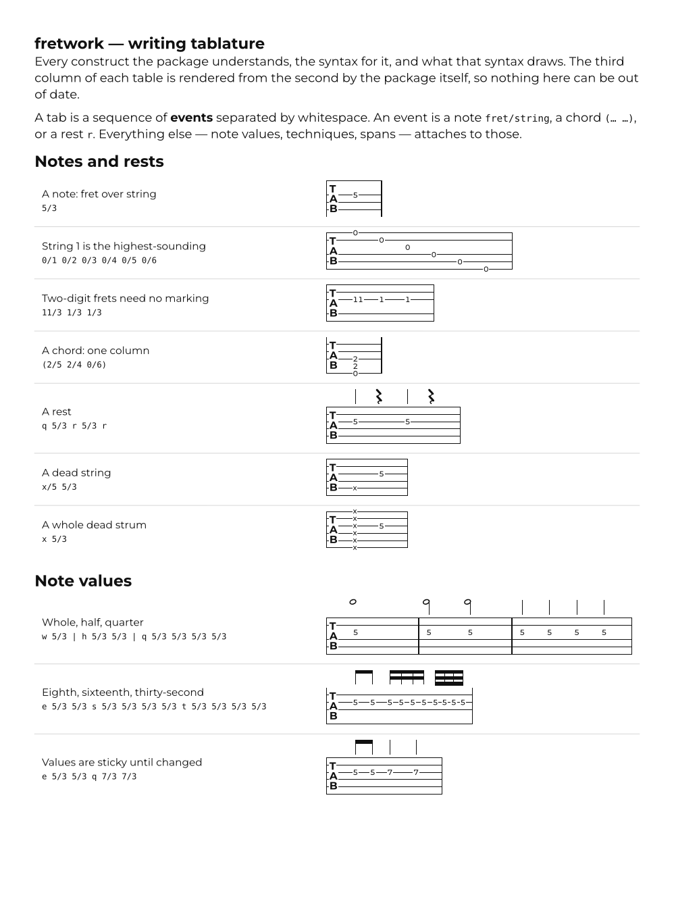
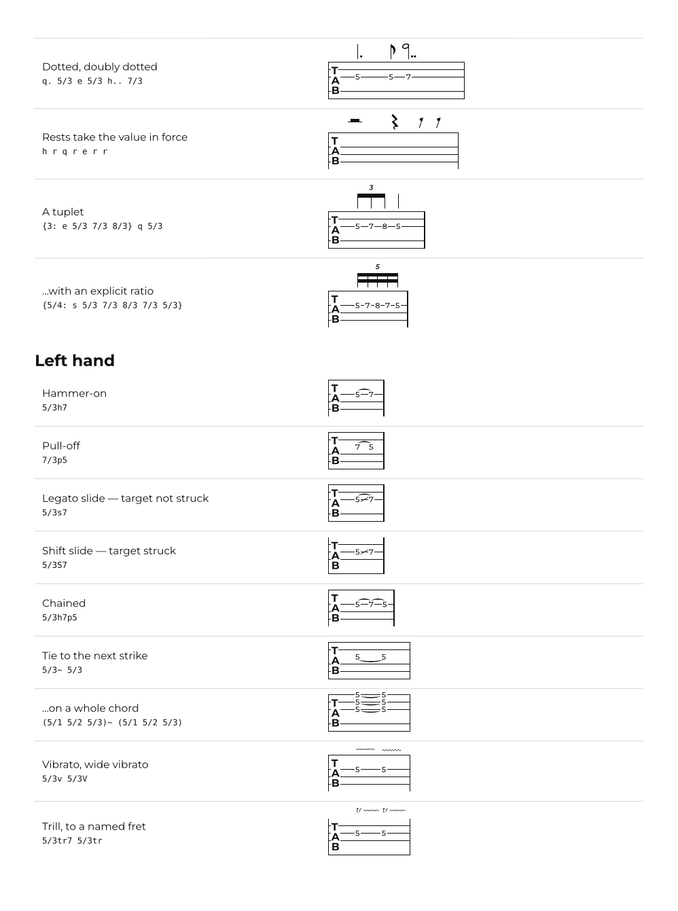
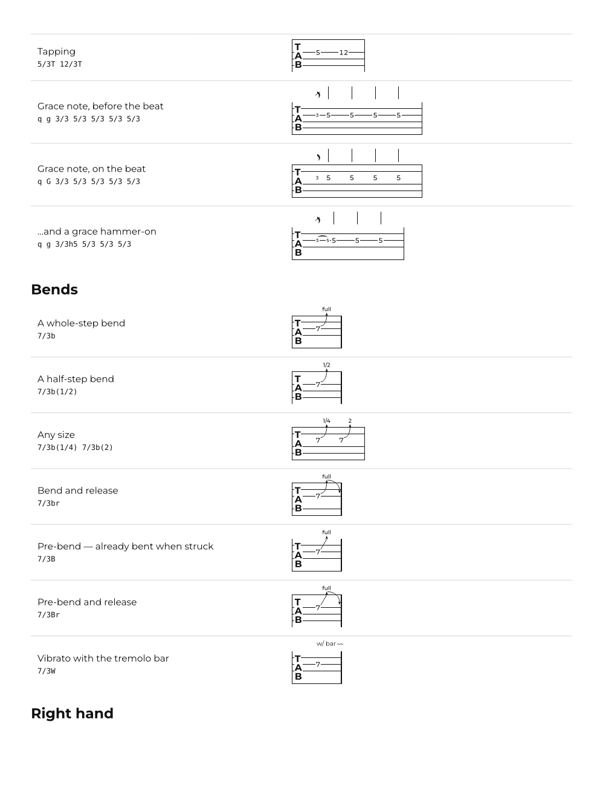
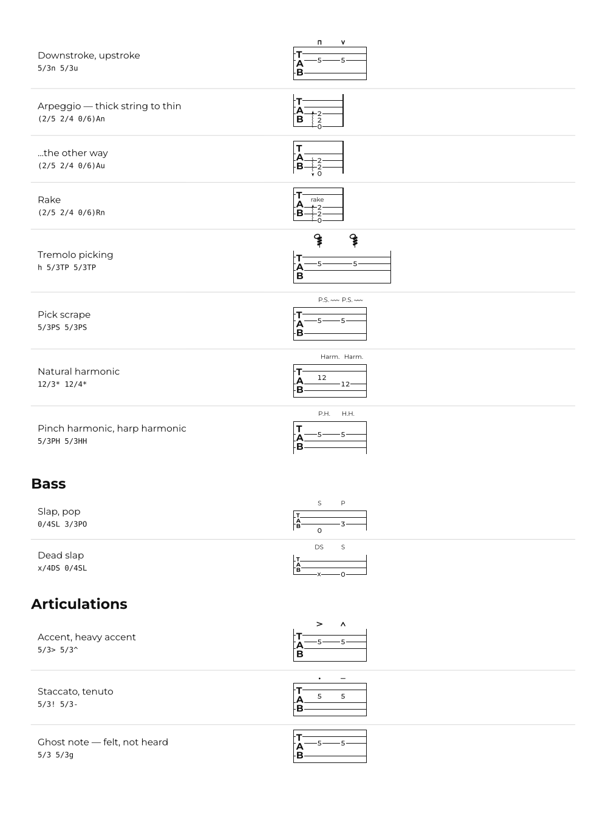
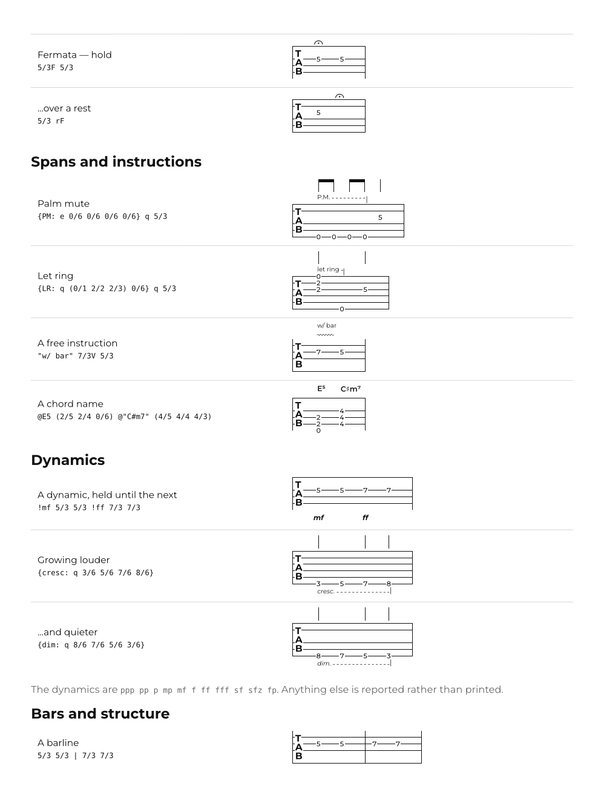
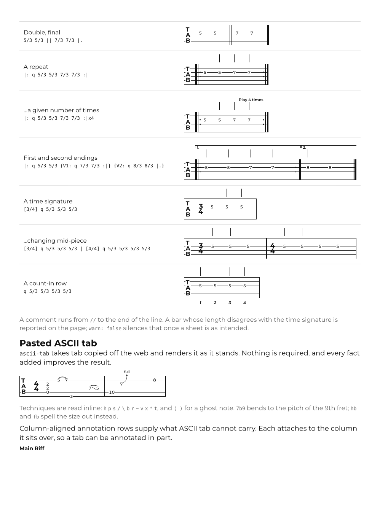
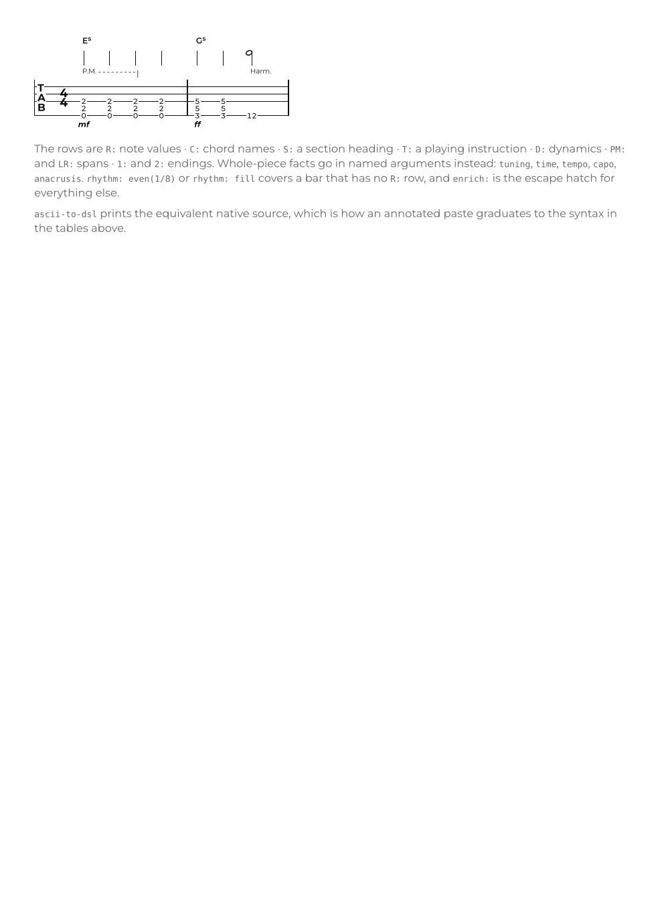

# Writing tablature with fretwork

Every construct the package understands, the syntax for it, and what that syntax
draws. The rendering beside each row is produced from the syntax beside it by the
package itself — [`docs/guide.typ`](docs/guide.typ) uses each string twice, once
set as code and once handed to `tab`, so a row cannot drift from what it
documents.

Regenerate with `docs/build.sh`; the rest of this file is written by it.

For the reasoning behind the design, see [SPEC.md](SPEC.md). For a working
sheet, see [`examples/songsheet.typ`](examples/songsheet.typ).

<picture>
  <source media="(prefers-color-scheme: dark)" srcset="docs/guide-dark-1.png">
  
</picture>

<picture>
  <source media="(prefers-color-scheme: dark)" srcset="docs/guide-dark-2.png">
  
</picture>

<picture>
  <source media="(prefers-color-scheme: dark)" srcset="docs/guide-dark-3.png">
  
</picture>

<picture>
  <source media="(prefers-color-scheme: dark)" srcset="docs/guide-dark-4.png">
  
</picture>

<picture>
  <source media="(prefers-color-scheme: dark)" srcset="docs/guide-dark-5.png">
  
</picture>

<picture>
  <source media="(prefers-color-scheme: dark)" srcset="docs/guide-dark-6.png">
  
</picture>

<picture>
  <source media="(prefers-color-scheme: dark)" srcset="docs/guide-dark-7.png">
  
</picture>
