# Writing tablature with fretwork

Every construct the package understands, the syntax for it, and what that syntax
draws, followed by a chapter on reading pasted ASCII tab.

The rendering beside each row is produced from the syntax beside it by the
package itself. The chapters in [`docs/guide/`](docs/guide/) are the source of
both: an example is written once, and `docs/build-guide.py` renders that same
string, so a row cannot drift from what it documents.

Regenerate with `docs/build.sh`. `GUIDE.md` is written by it — edit the chapters,
not this file.

For the reasoning behind the design, see [SPEC.md](SPEC.md). For a working
sheet, see [`examples/songsheet.typ`](examples/songsheet.typ).

## Writing tablature

A tab is a sequence of *events* separated by whitespace. An event is a note
`fret/string`, a chord `(… …)`, or a rest `r`. Everything else — note values,
techniques, spans — attaches to those.

### Notes and rests

| What it is | Syntax | |
|---|---|---|
| A note: fret over string | `5/3` | <picture><source media="(prefers-color-scheme: dark)" srcset="docs/guide/img/01-000-dark.svg"></picture> |
| String 1 is the highest-sounding | `0/1 0/2 0/3 0/4 0/5 0/6` | <picture><source media="(prefers-color-scheme: dark)" srcset="docs/guide/img/01-001-dark.svg">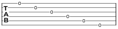</picture> |
| Two-digit frets need no marking | `11/3 1/3 1/3` | <picture><source media="(prefers-color-scheme: dark)" srcset="docs/guide/img/01-002-dark.svg">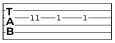</picture> |
| A chord: one column | `(2/5 2/4 0/6)` | <picture><source media="(prefers-color-scheme: dark)" srcset="docs/guide/img/01-003-dark.svg"></picture> |
| A rest | `q 5/3 r 5/3 r` | <picture><source media="(prefers-color-scheme: dark)" srcset="docs/guide/img/01-004-dark.svg">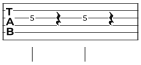</picture> |
| A dead string | `x/5 5/3` | <picture><source media="(prefers-color-scheme: dark)" srcset="docs/guide/img/01-005-dark.svg">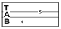</picture> |
| A whole dead strum | `x 5/3` | <picture><source media="(prefers-color-scheme: dark)" srcset="docs/guide/img/01-006-dark.svg"></picture> |
| A comment, to end of line | `5/3 // the rest of this line is ignored` | <picture><source media="(prefers-color-scheme: dark)" srcset="docs/guide/img/01-007-dark.svg">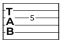</picture> |

### Note values

Note values are sticky: one holds until another is written.

| What it is | Syntax | |
|---|---|---|
| Whole, half, quarter | `w 5/3 \| h 5/3 5/3 \| q 5/3 5/3 5/3 5/3` | <picture><source media="(prefers-color-scheme: dark)" srcset="docs/guide/img/01-008-dark.svg"></picture> |
| Eighth, sixteenth, thirty-second | `e 5/3 5/3 s 5/3 5/3 5/3 5/3 t 5/3 5/3 5/3 5/3` | <picture><source media="(prefers-color-scheme: dark)" srcset="docs/guide/img/01-009-dark.svg"></picture> |
| Values are sticky until changed | `e 5/3 5/3 q 7/3 7/3` | <picture><source media="(prefers-color-scheme: dark)" srcset="docs/guide/img/01-010-dark.svg">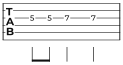</picture> |
| Dotted, doubly dotted | `q. 5/3 e 5/3 h.. 7/3` | <picture><source media="(prefers-color-scheme: dark)" srcset="docs/guide/img/01-011-dark.svg">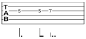</picture> |
| Every rest value, whole to thirty-second | `w r \| h r \| q r \| e r \| s r \| t r` | <picture><source media="(prefers-color-scheme: dark)" srcset="docs/guide/img/01-012-dark.svg"></picture> |
| Rests take the value in force | `h r q r e r r` | <picture><source media="(prefers-color-scheme: dark)" srcset="docs/guide/img/01-013-dark.svg"></picture> |
| A tuplet | `{3: e 5/3 7/3 8/3} q 5/3` | <picture><source media="(prefers-color-scheme: dark)" srcset="docs/guide/img/01-014-dark.svg">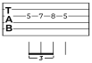</picture> |
| …with an explicit ratio | `{5/4: s 5/3 7/3 8/3 7/3 5/3}` | <picture><source media="(prefers-color-scheme: dark)" srcset="docs/guide/img/01-015-dark.svg"></picture> |
| Groups nest | `{3: {PM: e 5/3 7/3} 8/3} q 5/3` | <picture><source media="(prefers-color-scheme: dark)" srcset="docs/guide/img/01-016-dark.svg"></picture> |

### Beam grouping

| What it is | Syntax | |
|---|---|---|
| Eighths beam in half-bars | `e 0/6 2/6 3/6 5/6 3/6 2/6 0/6 2/6` | <picture><source media="(prefers-color-scheme: dark)" srcset="docs/guide/img/01-017-dark.svg">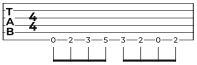</picture> |
| Sixteenths group by the beat | `s 0/6 2/6 3/6 5/6 3/6 2/6 0/6 2/6` | <picture><source media="(prefers-color-scheme: dark)" srcset="docs/guide/img/01-018-dark.svg">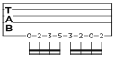</picture> |
| A lone eighth among sixteenths keeps a stub | `s 5/3 e 7/3 s 8/3 e 5/3 s 7/3 8/3` | <picture><source media="(prefers-color-scheme: dark)" srcset="docs/guide/img/01-019-dark.svg"></picture> |
| A syncopation carries its beam across the beat | `s 5/3 7/3 8/3 e 7/3 s 5/3 3/3 5/3` | <picture><source media="(prefers-color-scheme: dark)" srcset="docs/guide/img/01-020-dark.svg"></picture> |
| 3/4 beams a whole bar of eighths | `[3/4] e 0/6 2/6 3/6 5/6 3/6 2/6` | <picture><source media="(prefers-color-scheme: dark)" srcset="docs/guide/img/01-021-dark.svg">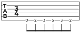</picture> |
| 7/8 counts 2+2+3 | `[7/8] e 0/6 2/6 3/6 5/6 7/6 8/6 10/6` | <picture><source media="(prefers-color-scheme: dark)" srcset="docs/guide/img/01-022-dark.svg">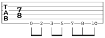</picture> |
| 6/8 counts in threes | `[6/8] e 0/6 2/6 3/6 5/6 3/6 2/6` | <picture><source media="(prefers-color-scheme: dark)" srcset="docs/guide/img/01-023-dark.svg"></picture> |

### Left hand

| What it is | Syntax | |
|---|---|---|
| Hammer-on | `5/3h7` | <picture><source media="(prefers-color-scheme: dark)" srcset="docs/guide/img/01-024-dark.svg">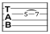</picture> |
| Pull-off | `7/3p5` | <picture><source media="(prefers-color-scheme: dark)" srcset="docs/guide/img/01-025-dark.svg"></picture> |
| Legato slide — target not struck | `5/3s7` | <picture><source media="(prefers-color-scheme: dark)" srcset="docs/guide/img/01-026-dark.svg"></picture> |
| Shift slide — target struck | `5/3S7` | <picture><source media="(prefers-color-scheme: dark)" srcset="docs/guide/img/01-027-dark.svg"></picture> |
| Chained | `5/3h7p5` | <picture><source media="(prefers-color-scheme: dark)" srcset="docs/guide/img/01-028-dark.svg">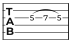</picture> |
| …to the next note instead, across a bar | `h 10/3s 5/1 \| h 3/3 5/1` | <picture><source media="(prefers-color-scheme: dark)" srcset="docs/guide/img/01-029-dark.svg"></picture> |
| Slide out of the note, up or down | `h 15/1sU 15/1sN` | <picture><source media="(prefers-color-scheme: dark)" srcset="docs/guide/img/01-030-dark.svg">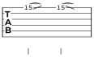</picture> |
| Tie — the far end is not struck | `5/3~ 5/3` | <picture><source media="(prefers-color-scheme: dark)" srcset="docs/guide/img/01-031-dark.svg"></picture> |
| …on a whole chord | `(5/1 5/2 5/3)~ (5/1 5/2 5/3)` | <picture><source media="(prefers-color-scheme: dark)" srcset="docs/guide/img/01-032-dark.svg"></picture> |
| Vibrato, wide vibrato | `5/3v 5/3V` | <picture><source media="(prefers-color-scheme: dark)" srcset="docs/guide/img/01-033-dark.svg"></picture> |
| Trill, to a named fret | `5/3tr7 5/3tr` | <picture><source media="(prefers-color-scheme: dark)" srcset="docs/guide/img/01-034-dark.svg">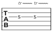</picture> |
| Tapping | `5/3T 12/3T` | <picture><source media="(prefers-color-scheme: dark)" srcset="docs/guide/img/01-035-dark.svg"></picture> |
| Grace note, before the beat | `q g 3/3 5/3 5/3 5/3 5/3` | <picture><source media="(prefers-color-scheme: dark)" srcset="docs/guide/img/01-036-dark.svg"></picture> |
| Grace note, on the beat | `q G 3/3 5/3 5/3 5/3 5/3` | <picture><source media="(prefers-color-scheme: dark)" srcset="docs/guide/img/01-037-dark.svg"></picture> |
| …and a grace hammer-on | `q g 3/3h5 5/3 5/3 5/3` | <picture><source media="(prefers-color-scheme: dark)" srcset="docs/guide/img/01-038-dark.svg">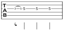</picture> |

### Bends

| What it is | Syntax | |
|---|---|---|
| A whole-step bend | `7/3b` | <picture><source media="(prefers-color-scheme: dark)" srcset="docs/guide/img/01-039-dark.svg"></picture> |
| A half-step bend | `7/3b(1/2)` | <picture><source media="(prefers-color-scheme: dark)" srcset="docs/guide/img/01-040-dark.svg"></picture> |
| Any size | `7/3b(1/4) 7/3b(2)` | <picture><source media="(prefers-color-scheme: dark)" srcset="docs/guide/img/01-041-dark.svg">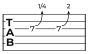</picture> |
| Bend and release | `7/3br` | <picture><source media="(prefers-color-scheme: dark)" srcset="docs/guide/img/01-042-dark.svg"></picture> |
| Pre-bend — already bent when struck | `7/3B` | <picture><source media="(prefers-color-scheme: dark)" srcset="docs/guide/img/01-043-dark.svg">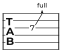</picture> |
| Pre-bend and release | `7/3Br` | <picture><source media="(prefers-color-scheme: dark)" srcset="docs/guide/img/01-044-dark.svg">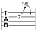</picture> |
| Vibrato with the tremolo bar | `7/3W` | <picture><source media="(prefers-color-scheme: dark)" srcset="docs/guide/img/01-045-dark.svg">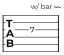</picture> |

### Right hand

| What it is | Syntax | |
|---|---|---|
| Downstroke, upstroke | `5/3n 5/3u` | <picture><source media="(prefers-color-scheme: dark)" srcset="docs/guide/img/01-046-dark.svg"></picture> |
| Arpeggio — thick string to thin | `(2/5 2/4 0/6)A` | <picture><source media="(prefers-color-scheme: dark)" srcset="docs/guide/img/01-047-dark.svg">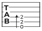</picture> |
| …written out, and the other way | `(2/5 2/4 0/6)An (2/5 2/4 0/6)Au` | <picture><source media="(prefers-color-scheme: dark)" srcset="docs/guide/img/01-048-dark.svg">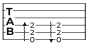</picture> |
| Rake | `(2/5 2/4 0/6)R` | <picture><source media="(prefers-color-scheme: dark)" srcset="docs/guide/img/01-049-dark.svg"></picture> |
| …and the other way | `(2/5 2/4 0/6)Ru` | <picture><source media="(prefers-color-scheme: dark)" srcset="docs/guide/img/01-050-dark.svg"></picture> |
| Tremolo picking | `h 5/3TP 5/3TP` | <picture><source media="(prefers-color-scheme: dark)" srcset="docs/guide/img/01-051-dark.svg"></picture> |
| Pick scrape, to the fret it stops at | `q x/3PS1 5/3 5/3 5/3` | <picture><source media="(prefers-color-scheme: dark)" srcset="docs/guide/img/01-052-dark.svg">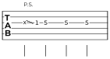</picture> |
| …the same over a longer note | `h. x/3PS12 q 5/3` | <picture><source media="(prefers-color-scheme: dark)" srcset="docs/guide/img/01-053-dark.svg"></picture> |
| …or to the next note on the string | `q x/3PS 5/3 5/3 5/3` | <picture><source media="(prefers-color-scheme: dark)" srcset="docs/guide/img/01-054-dark.svg"></picture> |
| Natural harmonic | `12/3* 12/4*` | <picture><source media="(prefers-color-scheme: dark)" srcset="docs/guide/img/01-055-dark.svg">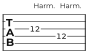</picture> |
| Pinch, artificial harmonic | `5/3PH 5/3AH` | <picture><source media="(prefers-color-scheme: dark)" srcset="docs/guide/img/01-056-dark.svg"></picture> |
| Harp, tap harmonic | `5/3HH 5/3TH` | <picture><source media="(prefers-color-scheme: dark)" srcset="docs/guide/img/01-057-dark.svg">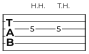</picture> |

### Bass

| What it is | Syntax | |
|---|---|---|
| Slap, pop | `0/4SL 3/3PO` | <picture><source media="(prefers-color-scheme: dark)" srcset="docs/guide/img/01-058-dark.svg">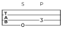</picture> |
| Dead slap | `x/4DS 0/4SL` | <picture><source media="(prefers-color-scheme: dark)" srcset="docs/guide/img/01-059-dark.svg"></picture> |

### Articulations

A note may carry a length mark, an attack mark and a stroke direction at once;
all three are drawn, stacked outward from the staff.

| What it is | Syntax | |
|---|---|---|
| Accent, heavy accent | `5/3> 5/3^` | <picture><source media="(prefers-color-scheme: dark)" srcset="docs/guide/img/01-060-dark.svg">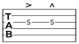</picture> |
| Staccato, tenuto | `5/3! 5/3-` | <picture><source media="(prefers-color-scheme: dark)" srcset="docs/guide/img/01-061-dark.svg"></picture> |
| All three at once | `5/3!>n 5/3-^u` | <picture><source media="(prefers-color-scheme: dark)" srcset="docs/guide/img/01-062-dark.svg"></picture> |
| Ghost note — felt, not heard | `5/3 5/3g` | <picture><source media="(prefers-color-scheme: dark)" srcset="docs/guide/img/01-063-dark.svg">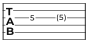</picture> |
| Fermata — hold | `5/3F 5/3` | <picture><source media="(prefers-color-scheme: dark)" srcset="docs/guide/img/01-064-dark.svg"></picture> |
| …over a rest | `5/3 rF` | <picture><source media="(prefers-color-scheme: dark)" srcset="docs/guide/img/01-065-dark.svg"></picture> |

### Spans and instructions

| What it is | Syntax | |
|---|---|---|
| Palm mute | `{PM: e 0/6 0/6 0/6 0/6} q 5/3` | <picture><source media="(prefers-color-scheme: dark)" srcset="docs/guide/img/01-066-dark.svg">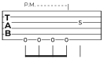</picture> |
| Let ring | `{LR: q (0/1 2/2 2/3) 0/6} q 5/3` | <picture><source media="(prefers-color-scheme: dark)" srcset="docs/guide/img/01-067-dark.svg">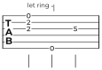</picture> |
| A free instruction | `"w/ bar" 7/3V 5/3` | <picture><source media="(prefers-color-scheme: dark)" srcset="docs/guide/img/01-068-dark.svg"></picture> |
| A chord name | `@E5 (2/5 2/4 0/6) @"C#m7" (4/5 4/4 4/3)` | <picture><source media="(prefers-color-scheme: dark)" srcset="docs/guide/img/01-069-dark.svg"></picture> |

### Lyrics

| What it is | Syntax | |
|---|---|---|
| One syllable per sung note | `q 5/3 7/3 8/3 7/3` | <picture><source media="(prefers-color-scheme: dark)" srcset="docs/guide/img/01-070-dark.svg">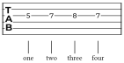</picture> |
| A word broken in two | `q 5/3 7/3 8/3 7/3` | <picture><source media="(prefers-color-scheme: dark)" srcset="docs/guide/img/01-071-dark.svg">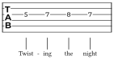</picture> |
| A word held — `_` spends a note | `q 5/3 7/3 8/3 7/3` | <picture><source media="(prefers-color-scheme: dark)" srcset="docs/guide/img/01-072-dark.svg"></picture> |
| Rests and ties are passed over | `q 5/3 r 8/3~ 8/3` | <picture><source media="(prefers-color-scheme: dark)" srcset="docs/guide/img/01-073-dark.svg">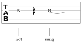</picture> |

### Dynamics

A dynamic holds until the next one. The set is closed: `ppp pp p mp mf f ff fff
sf sfz fp`.

| What it is | Syntax | |
|---|---|---|
| A dynamic, held until the next | `!mf 5/3 5/3 !ff 7/3 7/3` | <picture><source media="(prefers-color-scheme: dark)" srcset="docs/guide/img/01-074-dark.svg">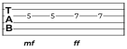</picture> |
| Growing louder | `{cresc: q 3/6 5/6 7/6 8/6}` | <picture><source media="(prefers-color-scheme: dark)" srcset="docs/guide/img/01-075-dark.svg">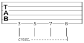</picture> |
| …and quieter | `{dim: q 8/6 7/6 5/6 3/6}` | <picture><source media="(prefers-color-scheme: dark)" srcset="docs/guide/img/01-076-dark.svg"></picture> |

### Bars and structure

| What it is | Syntax | |
|---|---|---|
| A barline | `5/3 5/3 \| 7/3 7/3` | <picture><source media="(prefers-color-scheme: dark)" srcset="docs/guide/img/01-077-dark.svg"></picture> |
| Double, final | `5/3 5/3 \|\| 7/3 7/3 \|.` | <picture><source media="(prefers-color-scheme: dark)" srcset="docs/guide/img/01-078-dark.svg">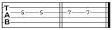</picture> |
| A repeat | `\|: q 5/3 5/3 7/3 7/3 :\|` | <picture><source media="(prefers-color-scheme: dark)" srcset="docs/guide/img/01-079-dark.svg"></picture> |
| …a given number of times | `\|: q 5/3 5/3 7/3 7/3 :\|x4` | <picture><source media="(prefers-color-scheme: dark)" srcset="docs/guide/img/01-080-dark.svg">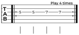</picture> |
| First and second endings | `\|: q 5/3 5/3 \| {V1: q 7/3 7/3 :\|} {V2: q 8/3 8/3 \|.}` | <picture><source media="(prefers-color-scheme: dark)" srcset="docs/guide/img/01-081-dark.svg">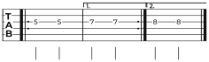</picture> |
| A time signature | `[3/4] q 5/3 5/3 5/3` | <picture><source media="(prefers-color-scheme: dark)" srcset="docs/guide/img/01-082-dark.svg"></picture> |
| …changing mid-piece | `[3/4] q 5/3 5/3 5/3 \| [4/4] q 5/3 5/3 5/3 5/3` | <picture><source media="(prefers-color-scheme: dark)" srcset="docs/guide/img/01-083-dark.svg"></picture> |
| A count-in row | `q 5/3 5/3 5/3 5/3` | <picture><source media="(prefers-color-scheme: dark)" srcset="docs/guide/img/01-084-dark.svg">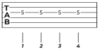</picture> |
| A pick-up bar before the first full one | `q 5/3 \| q 7/3 7/3 7/3 7/3` | <picture><source media="(prefers-color-scheme: dark)" srcset="docs/guide/img/01-085-dark.svg">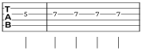</picture> |

## Pasted ASCII tab

`ascii-tab` takes the plain-text tab found on the web and renders it as it
stands. Nothing below is required — a bare paste always renders, and every fact
added improves the result. As in the tables above, each example is set from the
same string it is rendered from, so none of them can drift.

### What is read

A *block* is one row per string, written highest string first — the labels
before the barline say which, and a block whose labels are the tuning reversed
is read the other way round. *Column position carries simultaneity*: notes
standing in one column are struck together. Blocks stacked one after another
are one continuous passage rather than separate pieces, and lines that are
neither string rows nor annotation rows — titles, comments, chord charts — are
skipped with a warning.

```
e|-----------------|-----------------|
B|-----5h7---------|--------------8--|
G|--2--------------|-----7b9---------|
D|--2----------7\5-|-----------------|
A|--0--------------|--10-------------|
E|--------3--------|-----------------|
```

<picture><source media="(prefers-color-scheme: dark)" srcset="docs/guide/img/02-000-dark.svg">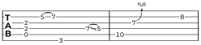</picture>


Adjacent digits are one fret as far as that fret exists, which is the only
reading that makes sense of both `-11-` and `-1-1-`: `-11-` is the eleventh,
`-1-1-` the first struck twice, `-77-` two sevenths — nothing is fretted at
the 77th — and `-010-` the open string then the tenth. Where the convention
can be wrong, brackets settle it: inside `( )` or `< >` the digits are one
fret however many there are.

### Marks read inside a row

| Mark | Meaning | Mark | Meaning |
|---|---|---|---|
| `h` | hammer-on | `p` | pull-off |
| `s` `\` | slide — out of the note where none follows | `~` `v` | vibrato |
| `b` | bend, to the pitch of the fret named | `r` | release, folded into the bend before it |
| `hb` `fb` | half and full bend, size spelled out | `pb` `pbr` | pre-bend, and pre-bend with release |
| `x` `X` | a dead string | `t` | tap — it marks the note it precedes |
| `*` | natural harmonic | `<` `>` | natural harmonic, as Power Tab writes it |
| `( )` | a ghost note — or a tie, see below | `\|` | a barline |
| `NH` `PH` `AH` | natural, pinch and artificial harmonic | `HH` `TH` | harp and tap harmonic |

A mark may stand anywhere between the notes it joins, and where it stands
decides what is drawn: `5h7`, the digits pressed against the mark, is one
event with the second number beside the first, while `5-h-7` is two events
joined by an arc — which is the only form that can reach into the next bar. An
`R:` row does the same to the compact form: a value over the target's column
says that note has a rhythm of its own. A slide with no note left to reach —
`15\` at the end of a row — is the note slid *off*, and the arrow says which
way the pitch leaves; a hammer-on or pull-off to nowhere means nothing and is
dropped. Marks chain: `5h7b9` bends the hammered seventh up to the pitch of the
ninth. A bend must rise, so `5b3` is reported and the note kept. The harmonic
marks are read in capitals, which collide with nothing since every other letter
is lower case, and none of them names a target fret: `7PH5` is the harmonic and
then the fifth. A source that writes them on a line of its own above the staff
uses a `T:` row instead. A pick scrape is written the same way but against an
`x`, having no pitch of its own — and it *does* read the digits against it,
`xPS1`, since those name the fret the pick stops at rather than a second attack.

```
e|--------------------------------------|
B|--------------------------------------|
G|--5h7p5--5s7--7fb--7b9r7--7PH--9-s-12\|
D|--xPS------5--------------------------|
A|----------------------------------x---|
E|----------(12)---<12>-----------------|
```

<picture><source media="(prefers-color-scheme: dark)" srcset="docs/guide/img/02-001-dark.svg"></picture>


**A fret in parentheses that repeats the note before it on the same string is a
tie** — the string is still sounding and is not struck again. Any other fret in
them is the ghost note the brackets otherwise mean. There is no other way to
write a held note in ASCII tab, where `~` is vibrato whatever the native syntax
uses it for.

`rhythm: even(1/4)`

```
e|--------------------------|--------------------------|
B|--------------------------|--------------------------|
G|--5-----(5)-----7-----(7)-|--------------------------|
D|--------------------------|--------------------------|
A|--------------------------|--0-----3-----(0)-----5---|
E|--------------------------|--------------------------|
```

<picture><source media="(prefers-color-scheme: dark)" srcset="docs/guide/img/02-002-dark.svg">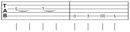</picture>


Both are written the same, in brackets, so the reading is what separates them —
and it is set back out differently: a ghost note keeps its brackets, a tie's
far end prints no number at all and is carried by the arc alone. A note struck
in between ends what the first was sounding, which is why the `(0)` above is a
ghost note and not a tie. A tie is read across a barline but not across the end
of a block, the reading being made row by row like every other mark that joins
two notes.

### Barlines, repeats and endings

`|` is a barline, and `||` is one barline drawn twice rather than two with a
bar of silence between them. The repeat colons are read as music: `|:` opens a
repeat, `:|` closes one, `:|:` closes one and opens the next where a repeated
section runs straight into another, and `x3` after the closing stroke says how
many times to play it. A bar with nothing written in it is a bar of silence,
and becomes the rest a published sheet would write.

```
R:  q   q   q   q    q   q   q   q
e|:----------------|-----------------:|x3
B|:----------------|-----------------:|x3
G|:----------------|-----------------:|x3
D|:--2---2---2---2-|--5---5---5---5--:|x3
A|:--2---2---2---2-|--5---5---5---5--:|x3
E|:--0---0---0---0-|--3---3---3---3--:|x3
```

<picture><source media="(prefers-color-scheme: dark)" srcset="docs/guide/img/02-003-dark.svg">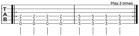</picture>


A count is read only after `:|`, since `x` is also a dead string: `|x3` in the
middle of a row is a muted string and then the third fret.

First and second endings are written as rows of their own, `1:` and `2:`, a run
of dashes marking the measures each covers. They attach to measures rather than
to events, which is what a volta is, and the first ending is closed off where
the repeat it leads back to is written.

```
1:                   --------------
2:                                  --------------
R:  q   q   q   q    q   q   q   q   q   q   q   q
e|:----------------|---------------:|---------------|
B|:----------------|---------------:|---------------|
G|:----------------|---------------:|---------------|
D|:--2---2---2---2-|--5---5---5---5:|--7---7---7--7-|
A|:--2---2---2---2-|--5---5---5---5:|--7---7---7--7-|
E|:--0---0---0---0-|--3---3---3---3:|--5---5---5--5-|
```

<picture><source media="(prefers-color-scheme: dark)" srcset="docs/guide/img/02-004-dark.svg"></picture>


### Annotation rows

Everything ASCII tab cannot carry is supplied by extra rows in the same block,
each prefixed with a key and a colon. Being column-aligned is the whole point:
a fact attaches to exactly the column it sits over, so nothing has to be
counted and a tab may be annotated in part.

| Row | Carries | Row | Carries |
|---|---|---|---|
| `R:` | note values, and rests where nothing is struck | `C:` | chord names |
| `L:` | sung syllables, one row per verse | `S:` | a section heading |
| `T:` | a free playing instruction | `D:` | dynamics |
| `PM:` `LR:` | palm mute and let ring — dashes mark the extent | `1:` `2:` | first and second endings |

```
S:  Main Riff
R:  q   q   q   q    q   q   h
C:  E5               G5
L:  Ha- ven't we met  be- fore
D:  mf               ff
PM: ---------
T:                           Harm.
e|----------------|----------------|
B|----------------|----------------|
G|----------------|----------------|
D|--2---2---2---2-|--5---5---------|
A|--2---2---2---2-|--5---5---------|
E|--0---0---0---0-|--3---3---12----|
```

<picture><source media="(prefers-color-scheme: dark)" srcset="docs/guide/img/02-005-dark.svg">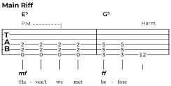</picture>


`R:` reuses the DSL's duration tokens deliberately — `w h q e s t`, dotted the
same way, and `3:` to open a tuplet — so there is no second notation to learn,
and a Power Tab or Guitar Pro export's own `W H Q E S` line pastes in
unchanged. Note values are sticky, as in the DSL. `C:` and `T:` rows split on
runs of two or more spaces, so an instruction may contain single spaces. Each
token attaches to the single nearest event within three columns, and one with
nothing near it is reported rather than moved — except a syllable, which is
given a column of its own so the voice can carry on where the guitar has
stopped.

**A block may carry more than one `R:` row**, read together column by column,
which is what makes `3:` writable in a tab whose events stand close: a tuplet
opener needs whitespace on both sides and rarely fits between two values.
Written on a row of its own it lands on the column it belongs to.

```
R:          3:
R:  q   q   q   q   q
e|---------------------|
B|---------------------|
G|--3---3---5---3---2--|
D|---------------------|
A|---------------------|
E|---------------------|
```

<picture><source media="(prefers-color-scheme: dark)" srcset="docs/guide/img/02-006-dark.svg"></picture>


Three quarters in the time of two, which is what lets a bar of five quarters
add up to four beats. A bar that disagrees with the meter is reported on the
page, and a missing tuplet is one of the things that announces itself that way.

**Rests are written in the `R:` row as well**, because ASCII tab spells silence
as filler and has nowhere else to put them. A value standing over a column
where nothing is struck is a rest that long, which is what lets a bar that
stops halfway through still add up to its meter.

```
R:  q   e   e   h            q   e   e   h
e|------------------------|------------------------|
B|------------------------|------------------------|
G|------------------------|------------------------|
D|------5---7-------------|------7---8-------------|
A|--0---------------------|--0---------------------|
E|------------------------|------------------------|
```

<picture><source media="(prefers-color-scheme: dark)" srcset="docs/guide/img/02-007-dark.svg"></picture>


The notes claim their tokens — each takes the nearest one within three
columns, the same reach every other row resolves by — and whatever no note
claimed is a rest where it stands. So a token that merely misses its note
still sets that note's value, while one written over a gap is a silence even
where the events are packed two columns apart. A bar with nothing said about
it is one bar-long rest, as before; a bar whose rests are named is divided as
the row says. Align the row and the bar adds up; a bar that does not is
reported on the page.

### Arguments and inference

Facts about the whole piece have no column, and are named arguments instead:
`tuning`, `time`, `tempo`, `capo`, `anacrusis`. Where annotating every column
would be busywork, `rhythm:` infers the note values — `even(1/8)` makes every
event an eighth, `fill` spreads each bar evenly across the time signature, and
a string such as `"q q e e | h h"` is spent event by event. `lyrics:` does the
same for a source with no `L:` rows. Annotation rows win over arguments, which
win over inference: a value already set is never overwritten.

`rhythm: even(1/8), time: (3, 4)`

```
e|--------------|--------------|
B|--------------|--------------|
G|--------------|--------------|
D|--2-2-2-2-2-2-|--------------|
A|--0-0-0-0-0-0-|--2-2-2-2-2-2-|
E|--------------|--0-0-0-0-0-0-|
```

<picture><source media="(prefers-color-scheme: dark)" srcset="docs/guide/img/02-008-dark.svg"></picture>


`tempo` and `capo` are carried into the model but drawn by the title block
rather than by the staff, so they appear on a page set with `song`.

Beyond the three there is `enrich: part => …`, which is handed the parsed part
and returns a modified one. The model is public API, so anything the rows and
the arguments do not reach can be set there.

`ascii-to-dsl(source)` prints the equivalent native source. Once a tab is
fully annotated it is as complete as one written by hand, and this is how it
graduates to the syntax in the tables above.
